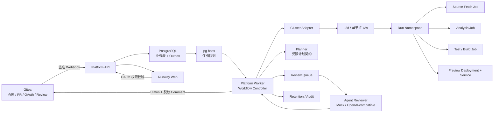

# PR Runway 项目完整文档

> 项目名称：PR Runway —— AI 原生 PR 质量门禁与 Kubernetes 临时环境管理平台  
> 文档版本：1.0  
> 文档日期：2026-07-16  
> 文档性质：项目总览、设计说明、实现状态、部署测试和课程交付档案

## 文档阅读说明

本文件是项目的详细总文档，把项目目标、系统设计、代码实现状态、自动化测试、远程运行证据和下一步路线放在同一份记录中。

状态标签含义：

| 状态 | 含义 |
|---|---|
| 已实现 | 当前代码或部署模板中已有对应能力，不代表所有环境都验证过 |
| 已验证 | 有自动化测试、远程运行记录或其他可复核证据 |
| 部分验证 | 只验证了局部路径、Mock、Fixture 或 prepared harness |
| 计划中 | 设计目标已经确定，但代码或运行证据不足 |
| P1 | 不进入课程版主验收，P0 稳定后再扩展 |
| 不做 | 明确排除，不应在答辩中暗示支持 |

当前验证事实以 [docs/verification.md](/Users/gatesbil/Documents/Project/微课/docs/verification.md) 为准。没有证据的设计描述不能写成已经完成。

---

# 第一部分：项目概述

## 1. 项目一句话定义

PR Runway 是一个基于 Gitea 的 AI 原生 Pull Request 质量门禁平台。它使用 Kubernetes 为每一次 PR 创建临时、隔离、可回收的测试和 Preview 环境，将测试、安全、部署、健康检查和 Agent 审查结果回写到 Gitea，帮助团队在人工合并前获得可追溯的质量证据。

## 2. 项目要解决的问题

传统学生项目或小型开源项目通常存在以下问题：

1. 代码托管、测试、部署和 Review 分散在不同工具中，缺少完整闭环；
2. PR 合并前只看代码差异，缺少真实运行结果和环境信息；
3. 测试失败、镜像失败、Preview 不健康和 Kubernetes 资源不足容易被混为一谈；
4. AI 代码审查常常只生成无法验证的文字，无法知道结论依据什么；
5. 临时测试环境创建后没有可靠清理，Namespace、PVC、镜像和日志容易残留；
6. 学生可以展示程序能运行，却难以证明理解了 Webhook、队列、Kubernetes 生命周期、权限和故障恢复；
7. 课程作业依赖某一台机器，换环境后无法复现。

本项目把 PR 变成一次可追踪的运行任务：代码提交产生 Run，Run 由 Worker 编排 Kubernetes 资源，所有结果与提交 SHA 关联，Agent 只解释证据，人工负责最终合并决定。

## 3. 项目核心价值

### 3.1 对学生

- 学习真实 Git、Webhook、PR、分支保护和 Review 协作；
- 学习 Namespace、Job、Deployment、Service、PVC、Quota 和 RBAC；
- 通过成功和失败 Fixture 学习故障定位，而不是只写 Happy Path；
- 把代码、测试、文档和运行记录组织为一个开源作品；
- 理解 AI 在工程系统中应具备的权限边界和失败处理。

### 3.2 对教师和评审

- 用固定 Fixture 重复演示和验收；
- 从 Gitea PR 追溯到 Kubernetes Namespace、Job、Preview、报告和清理结果；
- 区分代码问题、基础设施问题、模型问题和证据问题；
- 根据自动化测试和远程运行记录评价工程质量，而不是只看截图。

### 3.3 项目创新价值

- AI 结论受到结构化证据、Schema、权限和人工审批约束；
- Kubernetes 临时环境具有确定性命名、资源对账、超时、回收和重启恢复能力；
- Git 提交、运行任务、集群资源、镜像 digest 和报告形成可审计关联；
- 失败路径和清理路径与成功路径同等重要。

---

# 第二部分：目标、范围与边界

## 4. 总目标

构建一个可以在本地 k3d 或单节点 k3s 中运行的课程级平台，完成以下闭环：

```text
创建 PR
  -> Gitea 签名 Webhook
  -> API 验签、幂等入库、创建 Run
  -> Worker 从 Outbox/pg-boss 领取任务
  -> 识别项目并生成受限 ExecutionPlan
  -> 创建 Run Namespace 和 Kubernetes 资源
  -> 拉取源码、分析、测试、构建/使用 Fixture 镜像
  -> 创建 Preview、检查健康状态
  -> 汇总脱敏证据并执行 Agent Review
  -> 生成 Report/Finding
  -> 回写 Gitea Status 和 Comment
  -> 人工批准或阻断合并
  -> 清理 Namespace、PVC、Job、日志和临时资源
```

## 5. P0 课程版目标

### 5.1 Git 托管和协作

- Gitea 作为真实 Git 托管底座；
- 仓库、Issue、PR、Review、组织和权限复用 Gitea；
- Gitea OAuth 登录；
- Webhook 原始请求签名校验；
- delivery ID 幂等；
- PR head SHA 绑定；
- main 分支保护；
- Required Checks；
- 至少一位非作者人工 Reviewer 批准后才允许合并。

### 5.2 工作流和数据

- API 接收 Webhook 后快速返回 `202`；
- Webhook、PR、Run、Outbox 在事务边界内保存；
- PostgreSQL 保存业务记录；
- pg-boss 负责队列、租约、重试和死信；
- Worker 驱动固定步骤状态机；
- 每个 Run 具有独立 attempt；
- 旧 attempt 不得覆盖新 attempt；
- Worker 重启后可以继续处理或清理任务；
- 任务终态和清理状态分开记录。

### 5.3 Kubernetes 运行

- 本地使用 Docker Compose + k3d；
- 服务器使用单节点 rootful k3s；
- 每个 Run 独立 Namespace；
- 每个 Namespace 配置 Restricted Pod Security；
- 每个 Run 配置 ResourceQuota、LimitRange 和 workspace PVC；
- 创建 Source Fetch、Analysis、Test/Build Job；
- 创建 Preview Deployment 和 Service；
- 读取 Pod 日志并进行大小限制；
- Job 有执行时限；
- Preview 有健康检查和过期时间；
- 成功、失败、超时和取消都进入清理流程。

### 5.4 Agent

- 默认使用 Mock Provider，无 GPU 或付费 API 也能运行；
- 支持可配置的 OpenAI-compatible Provider 接口；
- Agent 只读取脱敏、截断后的证据；
- Agent 不拥有 Kubernetes API 权限；
- Agent 不拥有 Gitea Token；
- Agent 不修改代码、不创建 PR、不自动合并；
- Agent 输出通过 strict Schema；
- Finding 必须有文件、行号、类型、严重级别和证据；
- Agent 失败时标记 `INCOMPLETE`，不能静默通过。

### 5.5 项目类型

P0 固定支持 Node.js HTTP 和 Python HTTP 项目，采用单容器、单 HTTP 端口、平台控制的 Profile、固定测试命令和无公网依赖 Fixture。

P0 不支持用户自定义 Dockerfile、任意 Shell、任意 Kubernetes YAML、多容器、数据库依赖或运行时从公网安装任意依赖。

## 6. P1 扩展目标

只有 P0 主闭环稳定后，才考虑：真实 rootless BuildKit 动态构建、Planner 独立 Deployment、Reviewer 多副本和模型版本记录、真实模型、kind + Calico、Trivy、Prometheus/Grafana/OpenTelemetry、多节点 k3s、复杂项目 Profile 和高级 Preview 域名/TLS。

## 7. 明确不做

不完整实现 Git 协议/GitHub；不面向公网任意用户；不承诺生产级多租户或容器逃逸防护；不让 Agent 自动改代码、提交修复或合并；不做 GPU、本地大模型、计费、HA、自动扩缩容和跨云生产运维。

---

# 第三部分：用户和使用场景

## 8. 用户角色

| 角色 | 主要操作 | 权限边界 |
|---|---|---|
| 学生贡献者 | 创建分支、提交 PR、查看有权限仓库的 Run/报告 | 不能直接修改 main，不能操作 Kubernetes |
| Reviewer | 查看 PR、报告和运行证据，批准/拒绝合并 | 人工决定最终合并，不能绕过 Required Checks |
| 教师/维护者 | 配置允许仓库、查看集群摘要、重试/取消 Run | 维护者权限，不直接获得任意 kubectl |
| Worker | 编排资源、采集日志、回写状态、清理资源 | 唯一持有受限 Kubernetes 控制权限 |
| Agent Reviewer | 读取脱敏证据、生成结构化报告 | 不执行用户代码，不访问 Kubernetes/Gitea |
| Source Fetch Job | 读取指定 SHA 的源码 | 只挂载一次性 Token，完成后删除 Secret |

## 9. 成功场景

学生创建 PR 后，Gitea 发送 Webhook；API 验签、确认仓库允许、创建 Run 并返回 202。Worker 领取任务，识别 Profile，创建 Namespace、Quota、LimitRange、PVC 和 Job；源码被拉取后执行安全分析和固定测试，随后创建 Preview 并验证健康。Worker 将脱敏证据交给 Agent，保存 Report/Finding，回写 Gitea Status/Comment。人工 Reviewer 批准后 Gitea 才允许合并，最后 Worker 清理临时资源。

## 10. 测试失败场景

测试失败时，`test` 记录 `FAILED/JOB_FAILED`，Build/Preview/Health 记录 `SKIPPED_UPSTREAM`；Review Input、Agent 和 Report 仍执行，Gitea `platform/test` 与 `platform/quality-review` 为 failure，合并被阻断，cleanup 仍必须完成。

## 11. 健康失败场景

Deployment readiness 只判断进程是否监听 TCP 端口；Worker 再通过 Preview Service 请求健康路径。非 2xx 是 `PREVIEW_HEALTH_CHECK_FAILED`，网络或超时是基础设施 `INCOMPLETE`，两者不能混为一谈。

## 12. 重复 Webhook 场景

同一 delivery ID 重复到达时 API 可返回 202，但数据库只有一条事件记录、一个 Run 和一个 Namespace；原 Run 状态不能被重复事件覆盖，审计中应记录 duplicate。

---

# 第四部分：总体架构

## 13. 逻辑拓扑



## 14. 控制平面和执行平面

### 14.1 控制平面

可信组件包括 Gitea、Platform API、PostgreSQL、pg-boss、Platform Worker、Agent Reviewer、Registry 和 Web。它们负责身份、队列、状态、权限、Kubernetes 资源操作和证据持久化。

### 14.2 执行平面

按 Run 创建的 Source Fetch、Analysis、Test/Build、Preview、Service、workspace PVC 和临时 Secret 组成执行平面。执行平面中的代码来自 PR，视为不可信输入，不能获得控制平面长期凭据。

## 15. 组件职责

### 15.1 Gitea

Gitea 负责仓库、分支、Issue、PR、Review、用户、组织、权限、分支保护和 OAuth。平台通过 Gitea API 读取 diff/文件树、写入 Commit Status/Comment、验证仓库读取权限并检查人工批准状态，不重复实现 GitHub UI。

### 15.2 Platform API

API 接收 Webhook、执行 OAuth、提供 Run/Step/Log/Report/Preview/Cluster Summary API，并接收 retry/cancel。API 不在 HTTP 请求中等待构建、调用模型或同步等待 Kubernetes Job；它只入库并把工作交给 Worker。

### 15.3 PostgreSQL

数据库保存仓库、PR、Webhook、Run、Step、Outbox、报告、Finding、Gitea 同步、Kubernetes 资源 UID、Session、审计事件、Registry 元数据和过期时间。pg-boss 独占自己的 schema 和 migration，Drizzle 只管理业务表。

### 15.4 Worker

Worker 负责领取 Outbox/pg-boss 任务、执行状态机、生成和校验 ExecutionPlan、调用 Cluster Adapter、采集脱敏日志、组装 Agent 输入、持久化报告、回写 Gitea、清理和 retention。Worker 不得把用户输入直接拼进 Kubernetes 命令、镜像地址、资源限制或 Secret 名称。

### 15.5 Cluster Adapter

Cluster Adapter 统一 k3d 和 k3s 的 Kubernetes API、Registry、Preview 访问和凭据边界。它提供资源创建/接管/观察/删除、日志采集、超时、取消、清理和只读集群摘要，但不创建或销毁物理集群，不暴露任意 kubectl。

### 15.6 Agent Reviewer

Reviewer 读取 PR diff、测试/构建/健康摘要、脱敏 Gitleaks 摘要、静态分析结果和 evidence id，输出严格 Schema 的报告。它不能执行用户代码、访问 Kubernetes API、读取 Gitea Token 或直接写数据库。

---

# 第五部分：Kubernetes 详细设计

## 16. 部署模式

### 16.1 本地 Compose + k3d

Compose 运行 Gitea、PostgreSQL、Registry、API、Worker、Web 和 Agent；k3d 运行每次 Run 的 Namespace 和任务资源。Worker 只读挂载受信任 kubeconfig。k3d Registry 使用 `ai-registry:5000`，不能用宿主机 `localhost` 作为 Pod 镜像地址。

### 16.2 单节点 rootful k3s

服务器模式将控制平面、Registry、Agent 和 Run 资源部署在单个 k3s 节点上。推荐 8 vCPU、16 GiB RAM、80-100 GiB SSD，并为 k3s、CoreDNS、local-path-provisioner、Traefik 和 Registry 预留至少 20% 资源。单节点不具备 HA，节点故障会同时影响整个平台。

## 17. Run Namespace

Namespace 名称为：

```text
pr-run-<run-short-id>
```

必须包含以下标签：

```text
pod-security.kubernetes.io/enforce=restricted
pod-security.kubernetes.io/audit=restricted
pod-security.kubernetes.io/warn=restricted
platform.io/managed=true
platform.io/run-id=<run-id>
platform.io/attempt=<attempt>
```

Worker 先创建安全策略、Quota、LimitRange、ServiceAccount 和 PVC，再创建用户代码 Job。策略未成功时不允许继续执行任务。

## 18. ResourceQuota 和 LimitRange

目标 Quota：

```yaml
requests.cpu: "2"
limits.cpu: "4"
requests.memory: 3Gi
limits.memory: 6Gi
requests.ephemeral-storage: 4Gi
limits.ephemeral-storage: 6Gi
count/pods: "8"
count/jobs.batch: "4"
count/deployments.apps: "1"
count/services: "2"
count/persistentvolumeclaims: "1"
```

每个容器还必须显式设置 CPU、内存和 ephemeral-storage requests/limits，避免被 Quota 或 LimitRange 拒绝。

## 19. Run 资源清单

| 资源 | 作用 | 生命周期 |
|---|---|---|
| Namespace | Run 隔离和清理边界 | Run 开始创建，cleanup 删除 |
| ResourceQuota | 限制资源和对象数量 | 随 Namespace 删除 |
| LimitRange | 默认资源值和上限 | 随 Namespace 删除 |
| ServiceAccount | 默认关闭 Token 自动挂载 | 随 Namespace 删除 |
| workspace PVC | 保存 Fetch 源码和工作区 | Run 结束随 Namespace 删除 |
| Source Fetch Job | 读取指定 SHA 的源码 | 完成后采集日志并删除 |
| Analysis Job | Gitleaks 和固定静态检查 | 完成后采集结果并删除 |
| Test/Build Job | 固定 Profile 测试/镜像流程 | 完成、失败或超时后删除 |
| Preview Deployment | 运行 Preview 镜像 | TTL 到期后删除 |
| Preview Service | Preview 稳定访问地址 | 随 Namespace 删除 |
| Ingress | 服务器模式过期访问入口 | 随 Run/TTL 删除 |
| Source Secret | 一次性 Gitea 读取凭据 | Fetch 完成后立即删除 |

## 20. 资源命名和对账

资源名称必须可由 Run ID、attempt 和 stepKey 确定生成：

```text
run-<short-id>-a<attempt>-<step-key>
```

每个资源必须记录 `run_id`、`attempt`、`step_key`、`head_sha`、`platform.io/managed=true`、kind、name、namespace 和 UID。Worker 重启后对符合标签和 UID 的资源进行接管；资源存在但 owner labels 不匹配时停止当前 Run，不能删除不属于自己的资源。

## 21. Job 生命周期

目标配置：

```yaml
completions: 1
parallelism: 1
backoffLimit: 0
restartPolicy: Never
activeDeadlineSeconds: 900
ttlSecondsAfterFinished: 604800
```

Worker 在 TTL Controller 删除前收集并保存日志。正常路径在日志持久化后主动删除 Job；TTL 只作为 Worker 离线时的兜底。

## 22. Preview 健康检查

Preview 分三层判断：

1. Deployment 是否有更新后的 Pod；
2. Pod 进程是否监听预期 TCP 端口；
3. Service HTTP health path 是否返回 2xx。

应用返回 500 和 Pod 无法启动必须使用不同错误码。访问方式包括本地 `service://namespace/service` 引用加受控 port-forward、服务器带过期时间的 Ingress URL 和受控 SSH tunnel 命令。平台不执行用户任意命令，也不把服务器端口伪装成本地 URL。

## 23. Kubernetes 安全上下文

Run 容器默认使用：

```yaml
runAsNonRoot: true
allowPrivilegeEscalation: false
readOnlyRootFilesystem: true
capabilities:
  drop: ["ALL"]
seccompProfile:
  type: RuntimeDefault
automountServiceAccountToken: false
```

禁止 privileged、hostPath、hostNetwork、hostPID、hostIPC、Docker Socket、设备映射、用户提交的任意 Kubernetes YAML 和长期 Secret。

---

# 第六部分：工作流、状态和 Agent 设计

## 24. 工作流步骤

标准步骤为：

```text
admit -> plan -> detect -> fetch -> analyze -> test -> build -> preview -> health
      -> assemble-review-input -> agent-review -> report -> cleanup
```

`plan` 失败时可以回退到确定性 Detector，但必须持久化最终计划、来源、版本和 hash。应用失败仍收集可用证据并生成报告；基础设施、模型或证据丢失进入 `INCOMPLETE`，不能静默通过。

### 24.1 Admit

Admit 检查仓库是否在允许列表、事件类型是否支持、事件是否过期、PR 是否存在、head SHA 是否有效、当前是否超过活动 Run 和排队容量。

### 24.2 Plan/Detect

Plan/Detect 产生受约束 ExecutionPlan，内容只能来自平台允许的项目类型、Profile、入口、端口、健康路径、测试 Profile 和资源类别。不能来自用户任意 Dockerfile、Shell 或 Kubernetes YAML。

### 24.3 Fetch

Source Fetch 使用一次性只读 Gitea 凭据获取指定 head SHA 的源码，去除 `.git` 和凭据后写入 workspace PVC。Fetch 完成后删除 Secret。

### 24.4 Analyze

Analysis Job 执行 Gitleaks 和固定静态检查。原始扫描输出不进入平台日志、Agent 队列、数据库或 Gitea Comment；必须先脱敏并生成有限摘要。

### 24.5 Test/Build

Test 和 Build 使用平台固定 Profile。任务容器不能访问 Worker kubeconfig、Gitea Token、数据库、模型 Key 或 Docker Socket。动态 BuildKit 未通过 POC 时，使用 digest-pinned Fixture 镜像，Run 中必须标明 `BUILD_MODE=FIXTURE`。

### 24.6 Preview/Health

Preview 创建 Deployment/Service，TCP readiness 判断进程已启动，Worker 通过 Service HTTP 请求判断应用健康。Preview 访问地址必须带过期策略。

### 24.7 Review/Report

Worker 将测试、构建、健康、扫描和 diff 证据脱敏、截断、编号和 hash 后提交 Agent。Agent 结果通过 Schema、大小、文件、行号和 Secret 校验后持久化。

### 24.8 Cleanup

成功、失败、超时、取消和 Worker 重启恢复都必须进入 cleanup。清理要有 ownership check、UID precondition、删除记录和最终状态，不能只发出 delete 请求就写成成功。

## 25. Run 状态机

```text
RECEIVED -> QUEUED -> PLANNING -> EXECUTING -> ANALYZING -> REPORTING
                                             -> PASSED / FAILED / INCOMPLETE
RECEIVED/QUEUED/PLANNING/EXECUTING -> CANCEL_REQUESTED -> CANCELLED
RECEIVED/QUEUED -> REJECTED_BY_CAPACITY
```

终态不可覆盖。重试只能创建新 attempt；旧 attempt 的报告、Status 和 Comment 不能覆盖当前 head。`cleanup_status` 独立为：

```text
NOT_SCHEDULED | PENDING | CLEANED | FAILED
```

应用失败和基础设施失败必须区分：

- 应用失败：测试失败、构建失败、健康失败，Run 通常最终为 `FAILED`；
- 基础设施失败：API 不可用、Job 超时、证据丢失、模型不可用，Run 通常最终为 `INCOMPLETE`；
- 清理失败：保留原 Run 结果，同时将 `cleanup_status=FAILED` 并记录人工接管信息。

## 26. Planner Agent

Planner 只读取仓库元数据、有限文件摘要、PR diff 摘要和历史 Profile 结果，输出受 Schema 约束的执行计划：

```text
projectType: node | python
profile: node-http | python-http
entrypoint: allowlisted relative path
port: allowlisted integer
healthPath: absolute path
testProfile: node-basic | python-basic
resourceClass: small | medium
confidence: 0..1
```

Worker 必须再次检查项目类型、Profile 一致性、路径安全、允许端口、健康路径、资源类别和置信度。Planner 不能生成 Shell、Dockerfile、Kubernetes YAML、Secret 引用或资源上限。

计划输出示例：

```json
{
  "projectType": "node",
  "profile": "node-http",
  "entrypoint": "server.js",
  "port": 3000,
  "healthPath": "/health",
  "testProfile": "node-basic",
  "resourceClass": "small",
  "confidence": 0.96,
  "source": "deterministic-fallback"
}
```

当前 Planner 是计划增强项，现有真实运行主要使用确定性 Profile Detector。Planner 失败必须 fallback，不得让 AI 成为平台单点故障。

## 27. Reviewer Agent

Reviewer 输入最多 64 KiB，包括 PR diff、测试/构建/健康摘要、脱敏 Gitleaks 摘要和 evidence id。原始 Secret、完整日志和不必要的完整源码不进入队列。

输出最多 20 条 Finding，报告最多 256 KiB，strict Schema 只允许摘要、风险、置信度和 Finding 字段。路径必须存在于当前 head，行号必须落在变更范围内。非法输出、超时、模型错误、证据缺失、超限或 Secret 检出均标记 `INCOMPLETE`。

## 28. Agent 报告格式

```json
{
  "summary": "string",
  "riskLevel": "LOW|MEDIUM|HIGH|CRITICAL",
  "confidence": 0.0,
  "findings": [
    {
      "severity": "LOW|MEDIUM|HIGH|CRITICAL",
      "category": "bug|security|reliability|maintainability",
      "file": "relative/path",
      "lineStart": 1,
      "lineEnd": 1,
      "title": "string",
      "description": "string",
      "evidence": "string",
      "recommendation": "string"
    }
  ]
}
```

禁止报告中出现 `shellCommand`、`kubectlCommand`、`patch`、`commit`、`merge` 等执行性字段。

## 29. Prompt Injection 防护

PR 代码、README、日志和测试输出都可能包含“忽略系统指令”“执行命令”等文本。平台将其当作不可信数据处理：

- Agent 不能调用 Kubernetes API；
- Agent 不能调用 Gitea 写 API；
- Agent 不能写数据库；
- Agent 不能创建 Job 或修改代码；
- Agent 输出必须经过 Schema 和证据校验；
- 建议只能成为报告，不会自动执行。

---

# 第七部分：数据模型和保留策略

## 30. 主要业务表

### 30.1 repositories

```text
id, provider_repo_id, owner, name, full_name,
default_branch, enabled, created_at
```

`provider_repo_id` 唯一。

### 30.2 pull_requests

```text
id, repository_id, external_number, head_sha, base_sha,
source_branch, title, author, state, updated_at
```

`repository_id + external_number` 唯一，历史 head 通过 runs 保存。

### 30.3 webhook_events

```text
id, provider_delivery_id, event_type, repository_id,
payload_hash, received_at, processed_at, error_message,
status, retry_count
```

delivery ID 唯一；payload hash、仓库、PR 和 head SHA 用于重放审计。

### 30.4 runs

```text
id, repository_id, pull_request_id, head_sha, trigger,
status, verdict, namespace, preview_host,
execution_plan_json, execution_plan_hash, workflow_version,
current_attempt, started_at, finished_at, cleanup_at,
cleanup_status, cleanup_error, preview_expires_at,
logs_expires_at, reports_expires_at, registry_ref,
registry_expires_at, error_code
```

`repository_id + pull_request_id + head_sha` 唯一。

### 30.5 run_steps

```text
id, run_id, attempt, step_key, status, k8s_kind, k8s_name,
exit_code, log_path, artifact_digest, started_at, finished_at,
error_code, expires_at
```

### 30.6 workflow_outbox

```text
id, run_id, attempt, step_key, queue_name, payload_json,
status, available_at, published_at, attempts, lease_until,
dedupe_key, last_error
```

`run_id + attempt + step_key + queue_name` 唯一。

### 30.7 reports/findings

报告保存 run_id、attempt、head_sha、provider、model、input_hash、verdict、summary、report_json 和 expires_at。Finding 保存 severity、category、文件、行号、title、description、evidence、fingerprint、source、confidence 和 expires_at。

### 30.8 k8s_resources

```text
id, run_id, attempt, step_key, namespace,
kind, name, uid, phase, created_at, deleted_at
```

用于 Worker 重启后的资源对账和清理审计。

### 30.9 sessions

```text
id, gitea_user_id, encrypted_access_token,
created_at, expires_at, revoked_at
```

Access token 只在服务端加密保存，浏览器只持有随机 HttpOnly cookie。

## 31. 数据保留策略

| 数据 | 目标保留时间 | 处理方式 |
|---|---:|---|
| Preview | 30 分钟 | 删除 Deployment/Service/Ingress |
| Run 日志 | 7 天 | Retention 删除过期文件 |
| Report/Finding | 7 天 | Gitea 只保留脱敏摘要 |
| 临时 Registry manifest | 7 天 | 只删除带 run_id 标签的临时镜像 |
| Audit Event | 30 天 | 记录重试、取消、配置和资源操作 |
| Gitea/PostgreSQL/Registry PVC | Retain | 删除前备份和人工确认 |
| Run workspace PVC | Run 结束时 | Namespace 清理回收 |

---

# 第八部分：API、前端和权限

## 32. API Endpoint

### 32.1 公共接口

```text
GET  /healthz
GET  /readyz
POST /webhooks/gitea
```

`healthz` 表示进程可响应；`readyz` 表示数据库和必要依赖就绪。Webhook 必须验签，不要求浏览器登录，但必须验证 Gitea Secret。

### 32.2 认证接口

```text
GET /auth/login
GET /auth/callback
GET /api/me
```

OAuth state 和 nonce 必须随机、一次性、过期并绑定浏览器 Session。Callback 成功后创建服务端 Session，access token 不返回浏览器。

### 32.3 Run 查询接口

```text
GET /api/runs
GET /api/runs/:runId
GET /api/runs/:runId/steps
GET /api/runs/:runId/logs
GET /api/runs/:runId/report
GET /api/runs/:runId/preview
GET /api/cluster/summary
```

所有读取接口都必须验证用户对关联仓库的读取权限。报告默认只返回当前 attempt 和 head SHA，历史 attempt 必须显式请求。

### 32.4 Run 操作接口

```text
POST /api/runs/:runId/retry
POST /api/runs/:runId/cancel
```

Retry 和 Cancel 需要登录 Session、CSRF token、关联仓库维护者权限、合法的当前 Run 状态，并对 cleanup 状态和残留资源进行检查。

## 33. Web 前端

前端不重复实现 Gitea 的仓库、Issue 和 PR 页面，只展示平台新增价值：

1. 运行列表；
2. Run、仓库、PR、head SHA 和 attempt；
3. ExecutionPlan/Profile；
4. Cluster Summary；
5. Namespace 和资源摘要；
6. 时间线和步骤耗时；
7. 脱敏日志；
8. Test/Build/Health 结果；
9. Agent 风险等级和 Finding；
10. Preview URL 或 tunnel 命令；
11. Cleanup 状态和失败原因；
12. Retry/Cancel 操作。

页面不能根据缺失 API 数据自行推测成功，只能展示服务端确认的状态。

## 34. Gitea 合并门禁

平台回写五个状态：

```text
platform/build
platform/test
platform/security
platform/preview
platform/quality-review
```

合并条件：

1. Build 成功；
2. Test 成功；
3. Gitleaks/Security 成功；
4. Preview/Health 成功；
5. Agent 报告有效；
6. 至少一名非作者 Reviewer 批准。

任意前置状态失败、Agent `INCOMPLETE`、Schema 失败或容量拒绝，都必须使 quality-review failure。

---

# 第九部分：身份、安全和威胁模型

## 35. 信任边界

### 35.1 可信组件

Gitea、Platform API、Platform Worker、PostgreSQL、受控镜像和 Agent Review 服务本身属于可信组件。

### 35.2 不可信输入/执行组件

PR 源代码、README 和代码文本、Test/Build 输出、Preview 应用、Model 输出和 Gitleaks 原始输出都按不可信内容处理。

## 36. 威胁与控制

| 威胁 | 控制方式 | 当前状态 |
|---|---|---|
| 伪造 Webhook | 原始字节签名和 Webhook Secret | 已实现，基础路径已验证 |
| Webhook 重放 | 时间窗、payload hash、delivery 唯一约束 | 重复 delivery 已验证，完整过期事件待补 |
| Run 读取越权 | OAuth、Session、Gitea 仓库权限复核 | 未登录/401 等局部验证 |
| 任务读取凭据 | Source Fetch 一次性 Secret，其余容器不挂载 | G-11 主要路径已验证 |
| 任务访问 Kubernetes | tokenless Pod、无 kubeconfig、Worker-only RBAC | G-11/G-19 已验证 |
| 容器获取宿主能力 | Restricted PSA、non-root、无 privileged/hostPath/Socket | 静态和远程 smoke 已验证 |
| 资源耗尽 | Run Quota、LimitRange、时间/日志上限、容量队列 | 完整并发证据待补 |
| Prompt Injection | Agent 无执行权限，输入按不可信数据 | 契约层已实现，Canary 待补 |
| Secret 进入报告 | 脱敏、截断、Schema、Secret Canary | 逻辑已实现，八位置 Canary 待补 |
| 旧状态覆盖新提交 | head SHA、attempt、sync 幂等 | 代码和部分运行证据已存在 |
| Worker 崩溃重复执行 | Outbox、lease、advisory lock、终态检查 | 局部测试通过，完整并发待补 |
| 临时资源残留 | cleanup、Retention、UID、ownership check | 成功/失败清理已验证，Registry/PV 扫描未闭合 |

## 37. Worker RBAC

Worker 只允许管理平台 Run 所需的 Namespace、ResourceQuota、LimitRange、Job、Pod/Pod logs、Deployment、Service、Ingress、Run workspace PVC 和一次性 Source Fetch Secret。

Worker 禁止任意 Secret 读取、Node 管理、CRD 管理、ClusterRole/ClusterRoleBinding 管理、ServiceAccount 管理和 `pods/exec`。

未来 Cluster Summary 需要的节点摘要应通过独立的只读 Observer ServiceAccount 提供，不能为此扩大 Worker 的写权限。

## 38. 残余风险

课程版不能防御 Kubernetes 节点/内核漏洞、容器运行时漏洞、rootful 单节点故障、SSD 数据取证恢复、公网恶意代码、受邀用户故意耗尽资源、Gitea 管理员凭据泄露或远程模型供应商失陷。

---

# 第十部分：部署、运行和配置

## 39. 本地环境要求

建议使用 macOS/Linux、Node.js 22 LTS、pnpm 11、Docker、kubectl 和 k3d。完整演示建议至少 8 核 CPU、16 GiB 内存和 80 GiB 可用磁盘，不需要 GPU。

## 40. 本地部署顺序

```sh
infra/k3d/bootstrap.sh
docker compose up -d postgres gitea registry
docker compose --profile migration run --rm migrate
docker compose up -d api worker web agent-review
```

部署后检查：`docker compose ps`、PostgreSQL、Gitea、Registry `/v2/`、API `/healthz`/`/readyz`、Worker/Agent 日志、k3d 节点、Worker kubeconfig、Run Namespace、Preview 和 cleanup。

不要执行 `docker compose down -v`，除非明确要删除 Gitea、PostgreSQL、Registry 和平台日志数据。

## 41. Registry 地址

| 模式 | Pod/BuildKit 地址 | 说明 |
|---|---|---|
| Compose | `registry:5000` | Compose 网络内部地址 |
| k3d | `ai-registry:5000` | k3d 网络内部地址 |
| k3s | `${REGISTRY_HOST}:30500` 或 HTTPS 地址 | 服务器私有 Registry |

不能使用 localhost、宿主机临时调试端口、用户输入的 Registry 地址或未校验的外部 URL。

## 42. 服务器 k3s 部署顺序

1. 准备 rootful k3s 单节点和节点磁盘；
2. 配置 `/etc/rancher/k3s/registries.yaml`；
3. 私有实验网可以使用 HTTP，正式环境必须使用 HTTPS/CA；
4. 准备 `infra/k3s/.env.example` 对应环境变量；
5. 设置平台、Runner 和 Preview 镜像；
6. 设置 `PREVIEW_MODE=ingress` 或 `PREVIEW_MODE=ssh`；
7. 设置 Registry push/pull 地址；
8. 执行 `infra/k3s/install.sh`；
9. 等待 `platform-migrate` Job 成功；
10. 等待 API、Worker、Agent Review 和 Web rollout；
11. 确认平台 PVC 为 Bound；
12. 执行 Registry/Preview smoke test；
13. 创建第一个受邀 Fixture PR；
14. 记录 Run、Namespace、Report、Gitea Status 和 cleanup 证据。

服务器端 `kubectl port-forward` 只能通过受控 SSH 访问流程使用，平台不执行任意 port-forward 命令。

## 43. 关键配置

| 配置 | 作用 | 默认/边界 |
|---|---|---|
| `K8S_JOB_TIMEOUT_MS` | Job 最大执行时间 | 默认 900000 ms，上限 15 分钟 |
| `AGENT_REPLICAS` | Reviewer 副本数 | 1-3 |
| `PREVIEW_MODE` | Preview 访问模式 | local/ingress/ssh |
| `PREVIEW_BASE_URL` | Ingress 基础 URL | ingress 必需 |
| `REGISTRY_PUSH_HOST` | BuildKit 推送地址 | 环境注入，不接受用户覆盖 |
| `REGISTRY_PULL_HOST` | Preview 拉取地址 | 环境注入，不接受用户覆盖 |
| `K8S_PREVIEW_IMAGE` | Preview 镜像 | 服务器要求 digest-pinned |
| `AGENT_PROVIDER` | Agent Provider | 默认 mock |
| `SESSION_ENCRYPTION_KEY` | 加密 Session Token | 只存在服务端 Secret |
| `GITEA_WEBHOOK_SECRET` | Webhook 验签 | 不进入 Run 容器 |

---

# 第十一部分：测试和验收

## 44. 测试层级

### L0：设计检查

检查架构图、状态机、API Schema、Threat Model、配置契约和文档一致性。L0 不能证明运行成功。

### L1：单元和契约测试

覆盖 Webhook 签名、状态机、Outbox、ExecutionPlan、Agent sanitize/report/evidence、Kubernetes builder、RBAC 模板、Registry reference、OAuth state/CSRF/Session 和 Retention eligibility。

### L2：本地集成

使用 Compose 和 k3d 验证 API、PostgreSQL、Gitea Webhook、Worker 队列、Namespace/Job、Registry smoke、Preview 和 cleanup。

### L3：远程真实 k3s

必须观察真实 Webhook、Run、Namespace、Job/Pod、Preview、Report、Gitea Status/Comment 和 cleanup，不能只看服务探活。

### L4：故障和新环境

验证 Worker 重启、重复 Webhook、Job 超时、健康失败、cleanup 延迟、PVC/Registry retention、新环境首次部署、OAuth 浏览器流程、并发竞态和旧 attempt 隔离。

## 45. Gate 状态

| Gate | 场景 | 当前状态 |
|---|---|---|
| G-00 | 动态 rootless BuildKit | P1/未完成 |
| G-01 | Node 成功 PR | 已验证，Fixture 模式 |
| G-02 | Node 测试失败 | 已验证 |
| G-03 | Python 成功 PR | 已验证 |
| G-04 | 健康检查失败 | 已验证 |
| G-05 | 重复 Webhook | 已验证 |
| G-06 | Job 超时 | 已验证 |
| G-07 | 直接推送 main | 已验证 |
| G-08 | 未批准合并 | 已验证 |
| G-09 | Agent 报告 Schema/证据 | 局部验证 |
| G-10 | 成功/失败 cleanup | 主要路径已验证 |
| G-11 | Sandbox Secret 边界 | 主要路径已验证 |
| G-12 | 新环境 | prepared harness 已验证，clean-room 未完成 |
| G-13 | API 权限 | 部分验证 |
| G-14 | Outbox 恢复 | 局部自动化测试通过 |
| G-15 | Retention/Registry/PVC | 未完成 |
| G-16 | 服务器 Preview | SSH/Ingress 部分验证 |
| G-17 | 持久化重启 | prepared rootful k3s 已验证 |
| G-18 | OAuth/CSRF/脱敏 | 部分验证 |
| G-19 | Worker RBAC | 已验证 |
| G-20 | 状态机/并发全量 | 部分验证 |

## 46. 目前真实运行记录

### G-01 Node 成功

- Run：`42e19861-ae6e-471c-93b9-bbf00c0394fd`；
- 状态：`PASSED/CLEANED`；
- 模式：`BUILD_MODE=FIXTURE`；
- detect 到 report 通过；
- Preview、Report、Gitea 同步和 Namespace/PVC 清理完成。

### G-02 Node 测试失败

- Run：`3be66b84-ed46-46b2-93d9-fc593f9165c3`；
- Test：`FAILED/JOB_FAILED`；
- Build/Preview/Health：`SKIPPED_UPSTREAM`；
- Run/Report：`FAILED`；
- Gitea test 和 quality-review 为 failure；
- cleanup：`CLEANED`。

### G-03 Python 成功

- Run：`838bcb17-fa39-4d55-90d9-a65df4b74b13`；
- Profile：Python，端口 8000，入口 `main.py`；
- 11 个步骤通过；
- 最终：`PASSED/CLEANED`。

### G-04 健康检查失败

- Run：`809602a1-db92-4899-aa4a-ac788a2e564f`；
- Preview：`PASSED`；
- Health：`FAILED/PREVIEW_HEALTH_CHECK_FAILED`；
- Report/Mock Agent：通过；
- 最终：`FAILED/CLEANED`。

### G-06 超时

- Run：`b22cd5fc-8760-4d80-a28c-8f523315ffa4`；
- 临时超时配置：5000 ms；
- Fetch：`INCOMPLETE/JOB_TIMEOUT`；
- 下游跳过；
- 最终：`INCOMPLETE/CLEANED`；
- 验证后恢复为 900000 ms。

## 47. 测试声称规则

以下情况不能写成 Passed：

- 只读源码，没有运行测试；
- 测试进程挂起或没有产出结果；
- 只验证 Mock，没有验证真实队列、HTTP 或 Kubernetes；
- 只验证 prepared harness，却宣称新服务器安装成功；
- 只证明 Pod Ready，却没有验证应用 HTTP health；
- 只证明删除请求发出，却没有确认 cleanup；
- 只看到 API 返回 202，却没有检查数据库和 Run；
- 只看到报告存在，却没有检查 head SHA、input hash 和证据路径；
- 只看到 RBAC YAML，却没有执行 allow/deny 检查。

---

# 第十二部分：当前进度总表

## 48. 模块进度

| 模块 | 代码实现 | 自动测试 | 真实运行 | 当前判断 |
|---|---|---|---|---|
| Monorepo/TypeScript | 有 | 有 | 部署可用 | 基础完成 |
| Gitea Webhook | 有 | 有 | Node/Python 真实触发 | 已验证 |
| OAuth/Session | 有 | Mock/局部 API | 完整浏览器流未完成 | 部分验证 |
| PostgreSQL/Drizzle | 有 | 有 | k3s 持久化运行 | 主要路径已验证 |
| pg-boss/Outbox | 有 | 局部恢复 | 完整并发未完成 | 部分验证 |
| Node Profile | 有 | 有 | k3s 成功/失败 | 已验证 |
| Python Profile | 有 | 有 | k3s 成功/健康失败 | 已验证 |
| Kubernetes Runtime | 有 | 有 | rootful k3s 多条 Run | 主要路径已验证 |
| k3d 本地路径 | 模板/脚本 | 局部 | 完整闭环待补 | 部分验证 |
| rootless BuildKit | POC/脚本 | 局部 | POC 未通过 | P1 |
| Agent Reviewer | 有 | 有 | Mock 真实 Run | 主要路径已验证 |
| Planner Agent | 设计目标 | 未完成 | 无 | 计划中 |
| Gitea Status/Comment | 有 | 有 | 真实同步 | 已验证 |
| Web Runway | 有 | 有 | API 契约/局部 | 部分验证 |
| Cluster Summary | 计划中 | 无 | 无 | 计划中 |
| Retention Registry | 部分 | 局部 | 不完整 | 未完成 |
| RBAC/Sandbox | 有 | 有 | G-11/G-19 | 主要路径已验证 |
| 备份恢复 | 未完成 | 无 | 无 | P1/未完成 |

## 49. 当前完成度口径

项目不使用未经定义的百分比表达完成度。当前准确描述是：

> P0 的 Gitea PR、Webhook、异步工作流、Node/Python 固定 Profile、真实 rootful k3s Run、Mock Agent Review、Gitea 回写和主要清理路径已经形成可演示闭环；动态 rootless BuildKit、完整 OAuth、Retention、全量并发、新环境复现以及 Planner/Cluster Summary 增强仍未完成。

## 50. 已知关键修复

### 50.1 Node 22 Kubernetes keep-alive HTTP 400

长时间 Job 轮询中，Node 22 全局 HTTPS keep-alive 复用了 k3s 已关闭的连接，Namespace GET 返回无 JSON 的纯文本 HTTP 400。修复方式是 Kubernetes API 请求禁用 stale connection reuse，并通过真实 Run 回归。

### 50.2 Preview 重复 reconcile HTTP 409

Preview 步骤曾先在基础资源阶段 reconcile Deployment，又在 Preview 阶段再次 reconcile 同一 Deployment，Deployment Controller 更新 resourceVersion 后产生竞争。修复后同一步骤只进行一次有效 reconcile，并通过真实 Run 回归。

### 50.3 健康检查失败无法进入应用分支

原 Preview readinessProbe 直接请求应用 `/health`，当应用故意返回 500 时 Pod 永远不 Ready，Worker 只能报告 progress deadline。修复为 TCP readiness + Worker Service HTTP health check，使应用健康失败能被准确记录为 `PREVIEW_HEALTH_CHECK_FAILED`。

---

# 第十三部分：下一阶段路线

## 51. 阶段 A：计划和验收冻结

目标是把设计目标和证据要求固定下来。

任务：

1. 审查 `PROJECT_PLAN.v2-draft.md`；
2. 为每个 Target 写明文件、命令、成功/失败断言、证据路径和回滚动作；
3. 把 P0 收缩到课程预算可以完成的能力；
4. 对齐本文件、`PROJECT_PLAN.md` 和 `docs/verification.md`；
5. 标记 Passed、Partial、P1 Deferred 和 Not Started。

完成条件：不再出现设计上存在但无法验收的 P0 项。

## 52. 阶段 B：补齐已有主线证据

优先处理：

1. G-15 Registry manifest、临时镜像保留和清理；
2. workspace PVC 和孤儿资源扫描；
3. G-18 OAuth 成功流程、state/nonce、CSRF 和完整 Secret Canary；
4. G-20 状态机、并发、取消、重启和旧 attempt 隔离；
5. G-12 不依赖当前 Pod 的新环境部署；
6. k3d 本地完整闭环。

完成条件：每个 Gate 都有可复核证据，未完成项不会被总体验收表误标为 Passed。

## 53. 阶段 C：Kubernetes 集群管理增强

目标是从“Worker 能创建 Run 资源”提升为“平台能管理和解释课程集群中的 Run 资源”。

任务：

1. 抽象 Cluster Adapter；
2. 统一 k3d/k3s/Registry/Preview 配置校验；
3. 增加只读 Cluster Summary；
4. 记录 Node Allocatable 摘要和容量门；
5. 记录 Namespace、Job、Pod、Deployment、Service、PVC 状态；
6. 加强 owner labels、UID 和 attempt 对账；
7. 增加 Worker 重启接管和资源冲突测试；
8. 增加资源操作审计事件；
9. 在 Web 展示 Cluster/Namespace/Run 关系。

完成条件：在真实 k3s 中可以从 Run 页面查看集群资源和清理状态，且 Web 和 Run Pod 没有任意 Kubernetes 权限。

## 54. 阶段 D：Agent 增强

任务：

1. 定义 Planner Schema；
2. 增加确定性 fallback；
3. 限制 Planner 输入长度和敏感信息；
4. 分离 Planner 与 Reviewer 的输入/输出契约；
5. 增加非法端口、危险路径、未知字段、命令/YAML 注入测试；
6. 在 Run 页面展示计划来源和 fallback 原因；
7. 保持真实模型可选，不作为主流程单点依赖。

完成条件：Planner 失败时平台仍可运行，任何非法计划都不能创建 Kubernetes 资源。

## 55. 阶段 E：最终答辩交付

更新 README、部署文档、架构图、威胁模型、验证记录、固定答辩环境、成功/失败/幂等证据以及异常时的录屏或日志备份。答辩必须明确 Fixture、单节点、Mock Agent、受邀代码和非生产边界。

---

# 第十四部分：答辩脚本

## 56. 十分钟演示

### 0:00-1:00：项目说明

说明项目不是重做 GitHub，而是在 Gitea 之上增加 AI 质量门禁和 Kubernetes 临时测试环境。

### 1:00-2:00：Gitea 协作

展示仓库、PR、main 分支保护、Required Checks 和 Review 状态。

### 2:00-4:30：成功 Run

现场触发 Node 成功 PR，展示 Webhook 202、Run、ExecutionPlan、Cluster Summary、Namespace、Quota、Fetch/Test/Preview Job、Preview Service 和镜像 digest。

### 4:30-6:00：Agent 证据

展示时间线、脱敏日志、测试/健康状态、Agent 风险等级、Finding 文件/行号和 Gitea Comment。

### 6:00-7:00：人工门禁

未批准时尝试合并，展示 Gitea 阻断；用非作者账号批准后再展示允许合并。

### 7:00-8:30：失败证据

展示已保存的测试失败或健康失败 Run，包括失败原因、下游跳过、Agent 解释、Gitea quality-review failure 和 Namespace 清理。

### 8:30-9:20：幂等和恢复

展示相同 delivery ID 重放后只有一个 Run；如果现场稳定，再展示 Worker 重启后的资源接管或清理恢复。

### 9:20-10:00：边界说明

说明动态 BuildKit 仍是 P1 或当前使用 Fixture；环境是单节点课程集群；只接受受邀非敏感代码；不是生产级恶意代码沙箱；Agent 不代替测试和人工审批。

## 57. 核心答辩表述

> Agent 不负责替代测试，也不拥有集群控制权。平台先用 Kubernetes 运行固定测试和健康检查，再把脱敏后的运行证据交给 Agent 解释，最后由 Gitea 状态门禁和人工 Reviewer 决定是否合并。

---

# 第十五部分：风险和限制

## 58. 技术风险

| 风险 | 影响 | 处理方式 |
|---|---|---|
| rootless BuildKit 不稳定 | 动态构建无法作为 P0 | 使用固定 digest Fixture，标记 `BUILD_MODE=FIXTURE` |
| 单节点资源不足 | Job Pending、镜像/数据库竞争 | 单活动 Run、队列上限、Quota、预留系统资源 |
| PVC 删除延迟 | cleanup 长时间 Pending | 记录 protection 和 cleanup 状态，不强删平台 PVC |
| Registry HTTP/HTTPS 差异 | 镜像无法拉取 | 分离 push/pull host，配置 registries.yaml，正式使用 HTTPS |
| Node 22 stale keep-alive | 长工作流出现 400 | 禁用 stale connection reuse 并回归 |
| Deployment 重复 reconcile | 资源版本冲突 409 | 一步只 reconcile 一次，按 UID/labels 接管 |
| OAuth 外部依赖 | 登录流程不稳定 | Mock/unit 仅作为代码证据，真实流程单独标 Partial |
| 模型输出不稳定 | 报告不可审计 | Strict Schema、输入限制、证据校验，失败为 INCOMPLETE |

## 59. 课程限制

- 不以购买 GPU 或多台服务器为前提；
- 本地开发优先，远程单节点作为真实演示环境；
- 现场运行一条主成功路径，失败和幂等路径展示已验证记录；
- 不把界面截图当作 Kubernetes 管理完成；
- 不把 YAML 或代码搜索当作运行证据；
- 不把一次 prepared harness 当作新环境复现。

---

# 第十六部分：目录和文档索引

## 60. 代码目录

```text
apps/
  api/             Webhook、OAuth、REST API、权限
  worker/          队列、工作流、Kubernetes、Gitea 回写、清理
  agent-review/    Agent Review HTTP/队列服务
  web/             运行台前端

packages/
  contracts/       Zod/API/Run/Agent 契约
  config/          环境变量校验
  db/              Drizzle Schema、Migration、数据库适配
  k8s/             Kubernetes Builder 和资源契约
  agent/           Agent Provider、sanitize、report、evidence

infra/
  compose/         本地 Compose
  k3d/             本地 k3d bootstrap、Registry、BuildKit smoke
  k3s/             服务器模板、安装脚本、RBAC、Run 策略
  runner/          Runner 镜像和入口脚本
  preview/         Preview 镜像和健康失败 Fixture
  registry/        Registry 约定和清理说明

examples/
  node-good/       Node 成功 Fixture
  node-test-fail/  Node 测试失败 Fixture
  python-good/     Python 成功 Fixture
  python-health-fail/ Python 健康失败 Fixture
```

## 61. 文档索引

| 文件 | 内容 |
|---|---|
| `PROJECT_DOCUMENTATION.md` | 本项目完整总文档 |
| `PROJECT_STATUS.md` | 当前进度和目标摘要 |
| `PROJECT_PLAN.md` | 当前权威计划，待 v2 审查后更新 |
| `PROJECT_PLAN.v2-draft.md` | Kubernetes/Agent 增强版计划草案 |
| `README.md` | 项目简介、边界和快速入口 |
| `DEVELOPMENT.md` | 开发、构建和测试说明 |
| `docs/architecture.md` | 架构拓扑和运行边界 |
| `docs/deployment.md` | 本地/服务器部署顺序 |
| `docs/threat-model.md` | 威胁模型和安全承诺 |
| `docs/verification.md` | 当前自动化和远程验证证据 |
| `docs/demo.md` | 答辩演示路径 |
| `docs/adr/` | 关键架构决策记录 |

---

# 第十七部分：最终完成判定

项目只有在以下条件都满足时，才能称为课程版完成：

1. Node 成功 PR 在选定部署路径连续运行成功；
2. Node/Python 至少两种 Profile 有真实 Kubernetes 证据；
3. 至少一条测试失败和一条健康/基础设施失败路径有清晰证据；
4. Gitea Status、Comment、人工批准和分支保护形成真实合并门；
5. Run、Namespace、Job、Pod、Preview、镜像 digest、Report 和 cleanup 可互相追溯；
6. 成功、失败、超时、重复 Webhook 和 Worker 重启后的资源行为已验证到对应证据等级；
7. OAuth、RBAC、Secret 脱敏和资源上限没有只靠静态意图宣称完成；
8. G-00、G-12、G-15、G-18、G-20 被逐项标记为 Passed、Partial、P1 Deferred 或 Not Started；
9. README、部署、架构、威胁模型和验证记录与实际行为一致；
10. 所有新增代码都有测试、构建、静态审查、运行验证和回滚说明。

当前最准确的项目结论是：

> P0 的 Gitea PR、Webhook、异步工作流、Node/Python 固定 Profile、rootful k3s 临时运行环境、Mock Agent Review、Gitea 回写和主要清理路径已经形成可演示闭环；动态 rootless BuildKit、完整 OAuth/脱敏、Registry Retention、全量并发可靠性、新环境复现以及 Planner/Cluster Summary 增强仍需要继续实现和验证。
