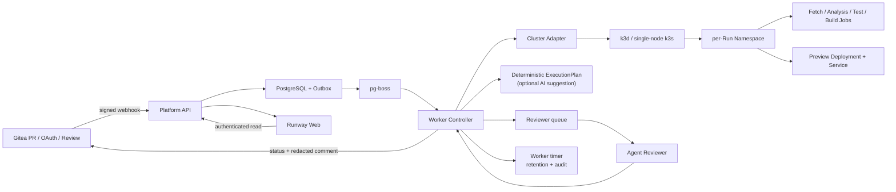

# PR Runway v2：AI 原生 PR 质量门禁与 Kubernetes 集群测试平台

> 状态：第二轮审查修订稿，仍未获得 R6 执行签字
> 修订日期：2026-07-16
> 适用场景：云原生课程作业、受邀学生团队、非敏感示例代码
> 权威性：本文件通过审查并替换 `PROJECT_PLAN.md` 后生效；在此之前，旧计划仍是历史参考，不作为新增实现的授权依据。

## 0. 计划决策

本项目的主方案确定为：

> 基于 Gitea 的 AI 原生 PR 质量门禁与 Kubernetes 临时环境管理平台。

旧的 Helm Chart 升级影响分析方案保留为独立的历史方案，不与本项目并行开发。当前代码、远程验收环境和侧边任务对话已经围绕 Gitea + k3s 形成真实闭环，因此本计划继续收敛这个方向，不重新切换选题。课程正式提交前必须确认教师评分口径接受该选题；如果课程硬性要求仍是 Helm 方案，本计划不能替代教师确认，必须停止实现并重新定题。

本次计划变更的重点不是把 Kubernetes 当作部署文件，而是把它定义为平台的执行控制面：平台必须能够为一次 PR 申请、编排、观察、回收一组受控 Kubernetes 资源，并将 Git 提交、执行计划、Namespace、Job、镜像 digest、Agent 报告和合并门禁关联为一条可审计证据链。P0 只把远程 rootful 单节点 k3s 作为真实运行主路径，k3d 作为本地开发和适配器 smoke path，不要求两套环境都完成同等强度的验收。

## 1. 产品目标

### 1.1 用户问题

学生在提交代码后，通常要手工完成构建、测试、部署、健康检查、日志查看和代码 Review。失败时很难知道问题来自代码、镜像、Kubernetes 资源、模型分析还是环境容量；教师也难以用一次可重复的 Demo 证明平台确实提高了托管质量。

### 1.2 目标闭环

```text
Gitea PR
  -> 签名 Webhook 与幂等入库
  -> 受限项目识别与 AI 辅助 ExecutionPlan
  -> 资源准入与容量排队
  -> Kubernetes 独立 Namespace
  -> Fetch / Analysis / Test / Build / Preview / Health Jobs
  -> 脱敏证据汇总
  -> Agent Reviewer 生成结构化报告
  -> Gitea Required Checks 与 Comment
  -> 人工批准或阻断合并
  -> Namespace、Job、PVC、临时镜像和日志按策略清理
```

### 1.3 课程交付目标

学生应能展示以下工程能力：

- 真实 Git 托管、PR、Review 和分支保护，而不是模拟 GitHub；
- 使用 Kubernetes API 进行 Namespace、Quota、Job、Deployment、Service、PVC 和日志的生命周期管理；
- 通过固定 Profile 和 Schema 控制 AI 输出，避免 Agent 直接生成任意 Shell 或 Kubernetes YAML；
- 将确定性测试结果和 AI 解释绑定到具体 head SHA；
- 在成功、代码失败、健康失败、超时、重复事件和 Worker 重启后仍有明确终态与清理证据；
- 能在本地和一台预算有限的服务器上重复部署和测试。

## 2. 创新点与不可替代的价值

### I1：证据驱动的 AI 质量门禁与可追溯链

Agent 不直接决定“能否合并”。平台先生成确定性证据：测试退出码、镜像 digest、健康状态、资源状态、脱敏扫描结果和日志摘要；Agent 只在受限输入上解释风险、定位 Finding 和提出建议。报告必须包含 evidence id、文件路径、行号或运行步骤，且绑定 `run_id + attempt + head_sha + input_hash`。

创新点在于把 LLM 从不可审计的评论机器人变成可校验的证据解释层：机器检查负责事实，人负责最终批准，Agent 负责降低阅读和定位成本。平台同时把 `repository + PR + head_sha -> run_id + attempt -> execution_plan_hash -> resource UID -> image digest -> input_hash -> report/status` 固化为一条链；旧提交和旧 attempt 不能覆盖当前 head。

### I2：PR 级 Kubernetes 临时环境编排

每个 PR Run 使用独立 Namespace、ResourceQuota、LimitRange、Restricted Pod Security、workspace PVC 和确定性资源名。Worker 通过 Kubernetes Client 执行对账和生命周期管理，而不是在 Web 请求里同步拼装命令。

平台将展示并记录：

- 集群、Namespace、Job、Pod、Deployment、Service、PVC 的状态；
- 每个对象的 owner labels、UID、创建/删除时间和当前步骤；
- 镜像来源与不可变 digest；
- 清理状态、残留对象和失败原因。

这使 Kubernetes 成为可观察、可恢复的测试环境管理能力，而不是仅存在于 `deployment.yaml` 中的装饰。

### I3：可审计的受约束 ExecutionPlan（P0）

P0 的唯一权威是确定性 Detector：它只能从允许的文件名、固定 Profile 和静态规则生成执行计划。计划必须记录来源、版本、hash、资源 class 和回退原因。AI Planner 只作为 P1 的可选建议器；它只能读取仓库元数据、有限文件摘要和历史 Profile 结果，输出受 Zod Schema 约束的执行计划：

```text
projectType: node | python
profile: node-http | python-http
entrypoint: allowlisted path
port: allowlisted integer
healthPath: absolute path
testProfile: node-basic | python-basic
resourceClass: small | medium
confidence: 0..1
```

Worker 必须再次执行白名单、路径、资源、镜像和命令校验。AI Planner 无法生成 Shell、Dockerfile、Kubernetes YAML、资源上限、Secret 引用或网络策略；无效、低置信度或模型不可用时只记录 `PLANNER_FALLBACK` 并使用确定性 Detector，不能让模型阻塞或放行不安全任务。答辩中若没有真实 Planner 运行证据，只展示“确定性计划 + 可选 AI 建议”的诚实边界。

### I4：Kubernetes 资源控制器与失败回收

平台不只演示成功路径。测试失败、健康检查失败、Job 超时、Webhook 重放、Worker 重启、容量不足和清理延迟都必须有显式状态、错误码、下游跳过规则和最终资源证据。课程版把 Worker 作为唯一 Kubernetes 控制者，Cluster Adapter 是 Worker 进程内的接口，Retention 是 Worker 的定时队列任务，不再引入多个互相争夺控制权的服务。这个设计比“部署一个 Hello World”更能体现云原生系统工程能力。

## 3. 范围冻结

### P0：课程主线必须交付

P0 的真实主路径是“准备好的 rootful 单节点 k3s + 固定 digest Fixture 镜像”。这条路径证明 Kubernetes 编排、部署测试、质量门禁和回收；它不声称动态构建任意 PR 代码。Node 是主答辩 Profile，已经存在的 Python 成功/健康失败证据作为第二 Profile 回归，但不再扩展第三种语言。

1. Gitea 仓库、PR、Review、OAuth、分支保护和五个 Required Checks。
2. 原始字节 Webhook 签名、delivery 幂等、过期事件拒绝、数据库事务 Outbox 和 pg-boss 唯一消费协议。
3. PostgreSQL 业务数据、Run/Step 状态机、attempt、CAS/fencing 和 head SHA 隔离。
4. 一个 Worker 进程内的 Kubernetes Cluster Adapter；rootful k3s 为 L3 主环境，k3d 只要求 L2 本地 smoke，不要求两套路径都重复全部 Gate。
5. Node/Python 固定 Profile、确定性 Detector 和可审计 ExecutionPlan；AI Planner 仅作 P1 建议，不是 P0 放行条件。
6. 每个 Run 创建独立 Namespace、Quota、LimitRange、默认 tokenless ServiceAccount 和 workspace PVC。
7. Source Fetch、Analysis、Test、Preview、Health 资源的创建、观察、日志采集、超时、对账和删除；Build 阶段在 P0 明确标记 `BUILD_MODE=FIXTURE`，只部署预构建 digest。
8. Preview 使用不可变镜像 digest；本地使用受控 port-forward，服务器使用带过期时间的 Ingress 或 SSH 隧道。
9. Reviewer Agent 的 Mock/可选 OpenAI-compatible Provider、脱敏输入、严格 Schema、证据引用和失败降级。
10. Gitleaks 结果在进入 Agent、数据库、日志和 Gitea Comment 前脱敏；报告严格 Schema、大小、路径、行号和 head SHA 校验。
11. 五个 Gitea Required Checks：`platform/build`、`platform/test`、`platform/security`、`platform/preview`、`platform/quality-review`，并定义每个 context 的幂等回写规则。
12. 一个非作者人工批准且当前 head 的全部门禁通过后才允许合并；Agent 不自动改代码、创建 PR 或合并。
13. Web 运行台：Run 时间线、Cluster/Namespace 摘要、步骤日志、报告、Preview 入口、失败原因和清理状态；没有 API 证据时不得推测资源状态。
14. 成功、测试失败、健康失败、超时、重复 Webhook、Worker 重启/恢复和容量拒绝 Fixture；取消保留为状态机单测和受控 L3 验证。
15. Worker 定时任务负责过期 Namespace、Run PVC、日志、报告和 Finding；Registry manifest 与 PV orphan 扫描只有在权限和完整运行证据具备后才可标 P0，否则明确 P1。
16. Docker Compose + k3d 本地开发路径、rootful k3s 主路径、固定镜像 push/pull/deploy smoke、部署文档和一条准备好的答辩 Demo。

P0 完成必须满足主路径 L3 与必要的 L1/L2 证据；“现有代码已实现但未运行验证”只能标 `implemented-unverified`，不能标 Passed。

### P1：P0 通过后再做

- 在 Restricted PSA 下通过真实 rootless BuildKit 完成动态镜像 push -> pull -> digest 部署；当前失败 POC 不得写成 P0 已完成。
- AI Planner、独立 `agent-planner` Deployment、多 Agent 独立队列和真实模型 Provider；先保留确定性 fallback。
- Registry manifest 写入/删除、过期清理、PV/PVC orphan 扫描和完整备份/恢复演练。
- 完整浏览器 OAuth、state 过期/跨浏览器绑定、有效 Session CSRF 和八位置 Gitleaks Canary；代码级测试仍可作为 P0 安全基线。
- kind + Calico NetworkPolicy 的跨 Namespace 连通性验证、Trivy、Prometheus/Grafana/OpenTelemetry。
- 多节点 k3s、HA、自动扩缩容、跨集群选择和 GPU 调度。
- 多容器项目、数据库依赖、任意包安装和用户自定义 Dockerfile。

### P2：明确不做

- 公网任意用户、生产级多租户或对抗容器逃逸的沙箱；
- 任意 Dockerfile、Shell、Kubernetes YAML 或用户指定资源限制；
- Agent 自动修改代码、自动提交修复、自动合并；
- 自研 Git 协议、完整 GitHub UI、云账单、GPU 或本地大模型平台。

## 4. 资源和部署边界

### 4.1 本地开发

- Docker Desktop 推荐 8 vCPU、16 GiB，最低 4 vCPU、8 GiB；可用磁盘至少 80 GiB；不需要 GPU。
- Docker Compose 运行 Gitea、PostgreSQL、Registry、API、Worker、Web、Agent 服务。
- k3d 承载每次 Run 的 Namespace 和任务资源；Worker 只读挂载受信任 kubeconfig。
- 完整 Run 同时最多 1 个，最多 3 个排队；超过容量创建 `REJECTED_BY_CAPACITY`，不能静默丢弃 Webhook。

### 4.2 服务器演示

- 单节点 rootful k3s，推荐 8 vCPU、16 GiB RAM、80-100 GiB SSD；不宣称 HA。
- 至少 20% 节点资源预留给 k3s、CoreDNS、local-path-provisioner、Traefik 和 Registry。
- Gitea、PostgreSQL、Registry、平台日志使用独立 PVC，回收策略 Retain；Run workspace PVC 使用 Delete。
- 默认一个 Reviewer 副本；最多三个副本只代表不同 Run 的队列消费能力，不为同一 PR 生成三份结论。
- 无稳定 DNS 时只验收 SSH 隧道模式；有 `PREVIEW_BASE_URL` 和 DNS/hosts 后才验收 Ingress URL。

### 4.3 Cluster Adapter 责任

Cluster Adapter 是 Worker 进程内的接口，不是第二个服务。它不创建或销毁物理集群，负责统一以下能力：

- 读取当前 cluster profile 和 API 可用性；节点 Allocatable 只由独立的只读 `platform-observer` ServiceAccount 提供，Worker ClusterRole 不获得 Node 权限；
- 创建、接管、观察和删除带 `platform.io/managed=true` 标签的 Run Namespace；
- 对账资源类型、名称、标签、UID 和 attempt；标签不匹配时停止 Run；
- 读取 Job/Pod 日志并截断到 20 MiB；
- 执行 bounded timeout、取消和清理；
- 将受限 Cluster Summary 写入数据库或由 API 通过 observer 查询；不暴露任意 kubectl 或 kubeconfig。

集群管理 API 只能返回平台允许的摘要和操作，不能成为通用 Kubernetes Dashboard。Cluster Summary 的读取要求 OAuth 登录和维护者权限，Run Pod 不能访问该 API。

Retention 不是第三个控制器：它是 Worker 的定时 pg-boss 任务，复用同一 Adapter 和数据库 lease。Registry manifest 删除通过受限 Registry API Client 完成；若没有可证明的 Registry 引用、删除和保留策略，Retention 只清理数据库/日志/Run Namespace，并将 G-15 标记 P1。

## 5. 目标架构



受信请求、队列和数据库不执行用户代码。只有 Worker 持有受限 Kubernetes 控制权限；Run 容器无 kubeconfig、ServiceAccount Token、Docker Socket、hostPath、privileged、host namespace 或长期 Secret。

## 6. 工作流和状态契约

### 6.1 步骤

```text
admit -> detect-metadata -> fetch -> plan/detect-finalize -> analyze -> test
      -> preview -> health -> assemble-review-input -> agent-review -> report
      -> cleanup
```

`detect-metadata` 只读取 Gitea 文件列表和 PR 元数据，`fetch` 将去掉 `.git` 与凭据的源码写入 Run workspace；随后确定性 Detector 生成最终 ExecutionPlan。P1 AI Planner 只能提出建议，Worker 校验后决定接受或回退；最终计划、来源、版本、fallback 原因和 hash 都必须持久化。应用失败仍收集可用证据并生成报告；基础设施、模型或证据丢失进入 `INCOMPLETE`，不能静默通过。

### 6.2 Run 状态

```text
RECEIVED -> QUEUED -> PLANNING -> EXECUTING -> ANALYZING -> REPORTING
                                             -> PASSED / FAILED / INCOMPLETE
RECEIVED/QUEUED/PLANNING/EXECUTING -> CANCEL_REQUESTED -> CANCELLED
RECEIVED/QUEUED -> REJECTED_BY_CAPACITY
```

终态不可覆盖。重试只能创建新 attempt，旧 Run/报告只读。`cleanup_status` 独立为 `NOT_SCHEDULED | PENDING | CLEANED | FAILED`，清理失败必须记录残留资源和人工接管动作。

### 6.3 资源确定性

对象名为 `run-<short-id>-a<attempt>-<step>`，labels 至少包含 `run_id`、`attempt`、`step_key`、`head_sha` 和 `platform.io/managed=true`。Worker 创建前对账；对象存在且标签/UID匹配时接管，不重复创建；对象冲突时终止并记录 `RESOURCE_OWNERSHIP_CONFLICT`。

## 7. Agent 契约

### 7.1 Planner 输入输出

输入最多 32 KiB，只包含仓库类型、文件名、受限片段、PR diff 摘要和历史 profile 结果。输出严格 Schema，未知字段、危险路径、非法端口、命令、YAML、Secret、资源上限或低置信度均拒绝。

Worker 先校验 Planner 输出，再执行固定 Profile。Planner 不拥有数据库写权限、Gitea Token、Kubernetes Token 或任务容器权限。

### 7.2 Reviewer 输入输出

输入最多 64 KiB，包含 PR diff、测试/构建/健康摘要、脱敏 Gitleaks 摘要和 evidence id。原始 Secret、完整日志和未脱敏代码不进入队列。

输出最多 20 条 Finding，报告最多 256 KiB，strict Schema 只允许 `summary`、`riskLevel`、`confidence` 和 Finding 字段。路径必须存在于当前 head，行号必须在变更范围内；HTML、JavaScript、终端控制字符和外部链接被清洗。

模型超时、Schema 错误、证据缺失或超限都标记 `INCOMPLETE`，不能标记质量通过。

## 8. Kubernetes 资源和安全基线

每个 Run Namespace 创建前必须配置：

```text
pod-security.kubernetes.io/enforce=restricted
pod-security.kubernetes.io/audit=restricted
pod-security.kubernetes.io/warn=restricted
platform.io/managed=true
```

任务容器统一使用 `runAsNonRoot`、固定非 root UID、`allowPrivilegeEscalation=false`、`readOnlyRootFilesystem=true`、drop ALL capabilities、RuntimeDefault seccomp、`automountServiceAccountToken=false`。可写内容只进入有 `sizeLimit` 的 `/tmp`、workspace PVC 或 analysis-output emptyDir。

Worker ClusterRole 只允许管理平台 Run 所需的 Namespace、Quota、LimitRange、Job、Pod/log、Deployment、Service、Ingress、PVC 和一次性 Source Fetch Secret；不允许读取 Node、CRD、ClusterRole、ClusterRoleBinding、RoleBinding、任意 ServiceAccount 或执行 `pods/exec`。任务 Pod 在 Pod spec 中显式设置 `automountServiceAccountToken=false`，不依赖 Worker 修改 default ServiceAccount；若未来要创建专用 ServiceAccount，必须单独审查权限并禁止绑定任何 Role。静态 RBAC 检查与远程 `kubectl auth can-i` 必须同时通过。

Worker 的 Gitea 写回凭据只作为受信任 Worker Deployment 的环境 Secret 注入，Worker 不通过 Kubernetes API 读取它；源码 Fetch 使用独立的一次性 Secret，完成后删除。Build/Test、Analysis、Preview 和 Agent 不得获得任何 Gitea Token。Agent 只读取脱敏证据和模型 Secret，不读取 Kubernetes API、数据库或 Gitea Token。

## 9. 数据模型和 API

关键表：`repositories`、`pull_requests`、`webhook_events`、`runs`、`run_steps`、`workflow_outbox`、`evidence_artifacts`、`reports`、`findings`、`gitea_syncs`、`k8s_resources`、`sessions`、`audit_events`、`registry_manifests`。

必须持久化：`execution_plan_json`、`execution_plan_hash`、`plan_source`、`workflow_version`、`attempt`、`head_sha`、`input_hash`、evidence/artifact id、资源 UID、镜像 digest、日志路径、过期时间、清理错误和审计事件。`evidence_artifacts` 只保存脱敏、截断后的摘要/哈希和来源步骤；原始 Secret、完整源码和未脱敏扫描输出不得进入数据库。

`workflow_outbox` 只是业务事务中的事件源，不重复实现 pg-boss 的 lease、重试和死信：事务同时写入 Webhook、PR 当前 head、Run 和 Outbox；Relay 用 `published_at`/lease 投递到 pg-boss；消费者用 `run_id + attempt + step_key` advisory lock 和终态检查防止重复外部副作用。Gitea Status/Comment 和 Kubernetes reconcile 都必须使用幂等键，写回前做 current-head CAS/fencing 检查。

API 分为三类：

- 公共探活：`GET /healthz`、`GET /readyz`；
- Webhook：`POST /webhooks/gitea`，签名和幂等必需；
- 认证读写：`GET /api/me`、Runs/Steps/Logs/Report/Preview/Cluster Summary，以及维护者限定的 retry/cancel。

所有 Run、日志、报告和 Cluster Summary 查询都必须复核当前用户对关联仓库的 Gitea 读取权限。retry、cancel 和配置修改必须 POST + CSRF + 维护者权限。OAuth state/nonce 一次性、5 分钟过期、绑定浏览器 Session，access token 只在服务端加密保存。

## 10. 验证策略：证据分级而不是口头完成

每个 Target 必须按以下顺序执行：

```text
实现 -> 单元测试 -> 类型检查/构建 -> 静态审查 -> 安全审查
     -> K8s manifest/schema 检查 -> 真实运行验证 -> 失败注入回归
     -> 文档和证据更新
```

证据分为：

- L0：设计/Schema，不能证明运行；
- L1：单元、契约、静态 YAML，证明局部逻辑；
- L2：本地 Compose/k3d 集成，证明可复现开发路径；
- L3：远程 rootful k3s 真实 Run，证明单节点课程部署；
- L4：清理后重启、重放、故障注入和新环境复现，证明可靠性。

只有达到验收矩阵要求的最低等级，才允许在 `docs/verification.md` 标记 Passed。Fixture 或静态结果不得冒充真实 Kubernetes、OAuth、Registry 或新服务器验证。

## 11. Target 验收矩阵

每个 Target 的实现代理只能修改“责任文件”，主线负责共享契约合并。表中的 `scripts/verify/*` 是计划要求新增的可复核脚本；脚本必须输出 JSON artifact，不允许只打印一句成功。

| Target | 责任文件/范围 | 必跑命令 | 通过条件 | 失败/回滚与证据 |
|---|---|---|---|---|
| T00 | 本计划、Target/Gate 清单、验证记录模板 | `node scripts/verify/plan-audit.mjs` | 每个 Target/Gate 有命令、最低 L、通过/失败/回滚、artifact 路径；旧题目冲突被明确记录 | 任一字段缺失则不进入 R6；artifact 写入 `artifacts/plan-audit.json` |
| T01 | `infra/k3d/*`、`infra/k3s/*`、Cluster Adapter | `bash -n infra/k3d/*.sh infra/k3s/install.sh && docker compose config --quiet && node scripts/verify/cluster-smoke.mjs --mode k3s` | k3s API Ready；Registry 地址非 localhost；固定 digest 可被目标 Runtime 使用；k3d 至少完成 adapter L2 smoke | 只回退固定 digest，不开放 Docker Socket；保存节点、Registry、imageID 和版本到 `artifacts/T01/` |
| T02 | `packages/k8s/*`、`infra/k3s/run-policy*`、`infra/k3s/rbac.yaml` | `node_modules/.bin/vitest run packages/k8s/src && node scripts/verify/rbac-boundary.mjs` | Namespace labels、Quota、LimitRange、Pod security、Pod tokenless、UID 对账和 allow/deny 集合全通过 | 任何权限扩大立即回退；保存 rendered YAML、`kubectl auth can-i` 和 Pod spec 到 `artifacts/T02/` |
| T03 | `apps/worker/src/workflow/plan*`、contracts/config | `node_modules/.bin/vitest run apps/worker/src/workflow/plan.test.ts apps/worker/src/workflow/state-machine.test.ts && node scripts/verify/fixture-plan.mjs` | Node/Python 计划字段、来源/hash、容量拒绝、Unsupported Profile 和 fallback 可重复；AI 不得成为唯一权威 | Planner 建议无效时回退 Detector；保存两种计划 JSON 和失败输入到 `artifacts/T03/` |
| T04 | `apps/worker/src/kubernetes/*`、runner/preview fixtures | `node_modules/.bin/vitest run apps/worker/src/kubernetes && node scripts/verify/remote-run.mjs --fixture node-good --mode k3s` | L3 成功 Run 的 Namespace、Job、Preview、Health、Report、Cleanup 全完成；固定镜像标 `BUILD_MODE=FIXTURE` | 动态 BuildKit 不通过则继续 Fixture P0、G-00 P1；保存 Run/Step/Namespace/Pod/Report JSON 到 `artifacts/T04/` |
| T05 | `packages/agent/*`、`apps/agent-review/*`、review queue | `node_modules/.bin/vitest run packages/agent apps/agent-review && node scripts/verify/agent-contract.mjs` | 脱敏、输入 hash、strict Schema、证据行号、超时/非法输出/Prompt Injection 均按预期；Reviewer 失败为 INCOMPLETE | 不引入 Planner Deployment；AI 不具备 K8s/Gitea 写权；保存输入摘要和报告校验结果到 `artifacts/T05/` |
| T06 | `apps/worker/src/gitea/*`、API Webhook/Status | `node_modules/.bin/vitest run apps/worker/src/gitea apps/api/src/webhook.controller.test.ts && node scripts/verify/gitea-gates.mjs` | 五个 context 按当前 head 幂等写回；旧 head 被 fencing；未批准或缺门禁不能合并 | 写回失败重试，不自动合并；保存 HTTP 状态、head SHA、context 和 Comment id 到 `artifacts/T06/` |
| T07 | `apps/api/*`、`apps/web/*`、Cluster Summary API | `node_modules/.bin/vitest run apps/api apps/web && node scripts/verify/authenticated-ui.mjs` | 登录用户只能看有仓库权限的 Run；Cluster Summary 不暴露 kubeconfig；UI 只展示 API 已确认状态 | UI/API 契约失败时关闭入口，不显示推测数据；保存 response fixture/截图到 `artifacts/T07/` |
| T08 | `apps/worker/src/retention*`、registry client、log store | `node_modules/.bin/vitest run apps/worker/src/retention.test.ts apps/worker/src/registry.test.ts && node scripts/verify/cleanup-retention.mjs` | Run Namespace、workspace PVC、日志、报告和 Finding 可按 TTL 清理；Registry/PV 只有具备独立权限和真实证据才标 Passed | Registry/PV 未闭环保持 P1；cleanup FAILED 记录残留，不强删平台 PVC；保存清理前后清单到 `artifacts/T08/` |
| T09 | Auth、CSRF、Gitleaks、RBAC、runtime templates | `node_modules/.bin/vitest run apps/api/src/auth.service.test.ts packages/agent/src/sanitize.test.ts && node scripts/verify/security-canary.mjs` | L1 安全基线通过；L3 Pod 无凭据、Worker deny 集合通过；完整浏览器/八位置 Canary 未完成时保持 P1 | 任何泄露立即阻断发布；保存脱敏摘要、Pod env/mount、can-i 到 `artifacts/T09/`，禁止保存 Secret 原文 |
| T10 | Outbox、状态机、Worker lease/restart/cancel | `node_modules/.bin/vitest run apps/worker/src/workflow && node scripts/verify/reliability.mjs --mode k3s` | 重复事件只一个 Run；崩溃后补投一次；旧 attempt 不覆盖新 head；超时/取消/容量拒绝终态可清理 | 保持单活动 Run、最多三队列；失败保留原 Run/attempt，不覆盖报告；保存 DB/queue/resource 时间线到 `artifacts/T10/` |
| T11 | `infra/*` docs、README、Demo/clean-room harness | `node scripts/verify/clean-room-install.mjs --mode k3s && node scripts/verify/demo-check.mjs` | 新环境按文档完成 migration、health、fixed-image smoke、首个 Run 和清理；若复用 prepared harness 必须明标 | 只能声明 prepared harness 时不标新环境 Passed；保存版本、命令、镜像 digest、PVC 和 Run artifact 到 `artifacts/T11/` |

### 11.1 Gate 到 Target 的映射

| Gate | 当前状态 | 绑定 Target | 最低证据和通过条件 |
|---|---|---|---|
| G-00 动态 BuildKit | P1 Deferred | T01/T04 | rootless BuildKit 在 Restricted PSA 下真实 push、Registry manifest、containerd imageID、digest Preview；Fixture smoke 不能替代 |
| G-01 Node 成功 | Passed，Fixture scope | T04/T06 | L3 `BUILD_MODE=FIXTURE`，Run/Report/五状态/Comment/Cleanup 绑定同一 head |
| G-02 Node 测试失败 | Passed，Fixture scope | T04/T06 | L3 test failure、下游 skip、quality failure、cleanup confirmed |
| G-03 Python 成功 | Passed，Fixture scope | T03/T04 | L3 Python plan、Test/Preview/Health/Report/Cleanup |
| G-04 健康失败 | Passed，Fixture scope | T04/T06 | Preview Ready 后 HTTP health 非 2xx，health failure、报告和清理均可见 |
| G-05 重复 Webhook | Passed | T03/T06/T10 | 同 delivery/head 只有一个 event、Run、Namespace |
| G-06 Job 超时 | Passed，prepared harness | T04/T10 | `JOB_TIMEOUT`/`INCOMPLETE`、下游 skip、cleanup confirmed |
| G-07 直接推送 main | Passed | T06 | Gitea 返回拒绝，main 无未门禁提交 |
| G-08 未批准合并 | Passed | T06 | 当前 head 缺人工批准时 Gitea 拒绝合并 |
| G-09 Agent 报告 | Passed，Fixture scope | T05/T06 | strict Schema、证据路径/行号、input_hash、Comment 脱敏 |
| G-10 Run 清理 | Passed，已有路径 | T04/T08/T10 | 成功、失败、超时、重启后 Namespace/PVC 终态可确认 |
| G-11 Secret 边界 | Passed，prepared smoke | T02/T09 | Runner/Analysis/Preview 无 token/key/kubeconfig/敏感 env/mount |
| G-12 新环境 | Pending | T01/T11 | 无预装材料的 clean-room 安装、migration、首个 Run、回收；prepared harness 单独标注 |
| G-13 API 权限 | Partial | T07/T09 | 401/403、仓库权限、维护者 retry/cancel、Cluster Summary 权限 |
| G-14 Outbox 恢复 | Partial L1 | T06/T10 | DB 事务、relay lease、pg-boss 重投和外部副作用单写的 L3 证据 |
| G-15 Retention/Registry/PV | P1 Deferred | T08 | manifest 引用写入、过期删除、基础镜像保护、orphan 扫描和 PVC/PV 证据 |
| G-16 服务器 Preview | Partial | T01/T04/T07 | Ingress URL 或明确 SSH 隧道，访问控制、expires_at 和回收证据 |
| G-17 持久化重启 | Passed，prepared harness | T11 | API/Worker/Agent 重启后 Run/Report/Gitea/Registry/PVC 仍可读；备份恢复另计 |
| G-18 OAuth/脱敏 | Partial | T05/T09 | 浏览器 OAuth/state/CSRF/Canary 全套；当前 Mock/代码级证据不能升格 |
| G-19 Worker RBAC | Passed，当前基线 | T02/T09 | 必要 allow、Node/CRD/任意 Secret/RBAC/exec deny 集合；Observer 权限单列 |
| G-20 状态机/可靠性 | Partial | T03/T10 | 合法转移、CAS/fencing、取消、容量、重启、并发和 cleanup 的聚合 L3/L4 |

## 12. 当前证据基线与待办

截至 2026-07-16，`docs/verification.md` 已记录并可复核：

- G-03 Python 成功、G-04 健康失败、G-05 重复 Webhook、G-06 超时；
- G-07 直接推送 main、G-08 未批准合并；
- G-11 Sandbox Secret 边界、G-17 准备好的 rootful k3s 重启持久化、G-19 Worker RBAC；
- G-01/G-02 Node 成功与测试失败，以及恢复后成功；
- Node 22 stale keep-alive 导致 HTTP 400、Preview 重复 reconcile 导致 HTTP 409 的真实根因和修复。

不得把以下内容视为完成：

- G-00 动态 rootless BuildKit POC 失败后的 P1 状态；
- G-12 新的、未预装材料的服务器复现；
- G-15 Registry manifest 写入、Retention 和孤儿 PVC/PV 的完整闭环；
- G-18 有效 OAuth 浏览器流程、state 过期、有效 Session CSRF 和完整八位置 Gitleaks Canary；
- G-20 聚合并发/状态机全量证据；
- Planner Agent、Cluster Summary 和多 Agent 独立队列若尚未有代码与运行证据。

## 13. 多轮审查协议

### R1：架构审查

检查目标是否仍是 Gitea + K8s PR 质量平台；检查 Planner、Reviewer、Worker、Analysis Job 的边界；检查是否重复实现 Git 或引入无法验收的微服务。

### R2：Kubernetes 可执行性审查

逐项检查 k3d/k3s 地址、Registry push/pull、Pod 安全上下文、Quota 总量、PVC 回收、Ingress/SSH 访问、Job deadline、资源 UID 对账和 Worker 重启恢复。任何只在 YAML 中存在、没有命令或运行证据的能力都标为风险。

### R3：安全/RBAC 审查

检查源代码、模板和运行时的 Token、Secret、kubeconfig、Docker Socket、hostPath、privileged、任意命令、任意 YAML、跨 Namespace 访问、Prompt Injection、XSS、CSRF、OAuth state 和日志脱敏。审查代理不能直接修改文件。

### R4：测试与证据审查

为每个 Target 指定测试文件、命令、预期结果和最低证据等级；确认失败、超时、取消、重放、重启、容量拒绝和清理路径均有可观测证据；拒绝用同一 Fixture 证明不相关目标。

### R5：课程范围、预算和答辩审查

检查 16 GiB 本地机和 8 vCPU/16 GiB 单服务器是否能运行；检查 10 分钟内能否完成主 Demo；检查创新点是否能通过 UI、kubectl 和 Gitea 证据展示；删除不影响主闭环的功能。

### R6：执行前签字门

只有 R1-R5 的阻塞项关闭，Target 文件边界、回滚方式、测试命令、真实环境前置条件和证据位置都已写明，才允许调用代码实现子代理。审查代理不得因为“看起来合理”而给出 Passed。

## 14. 子代理并发和文件边界

并发上限为 32。执行采用批次，不为追求数量而制造文件冲突：

- 计划审查批次：最多 8 个只读审查代理；
- 实现批次：最多 16 个 Worker，每个拥有明确的不重叠文件责任；
- 集成/安全/运行批次：最多 8 个审查或验证代理；
- 合计任何时刻不超过 32 个。

每个代码 Worker 必须知道自己不是唯一修改者，不得回退他人改动，只能修改分配的文件集合；最终结果必须列出修改文件、测试命令、构建结果、已知限制和建议的回滚点。不同 Worker 不能同时改同一个模板、Schema、数据库 migration 或测试夹具；共享契约由主线先冻结，再分派实现。

## 15. 分阶段执行顺序

### Phase A：计划冻结和审查

生成本计划、Target/验收矩阵、威胁模型和证据模板；完成 R1-R5，修订计划，再通过 R6。

### Phase B：先补阻塞的基础能力

优先处理 G-15、G-18、G-20、G-12 和 Cluster Adapter/Cluster Summary 的实际缺口。每个 Target 都必须完成本计划第 10 节的完整门，不允许为了增加创新点而跳过既有回归。

### Phase C：增强 Agent 和 K8s 主线

实现 Planner 受限契约、deterministic fallback、Reviewer 独立队列/职责、ExecutionPlan 可视化、资源对账和集群摘要。先使用 Mock Provider 和固定 Profile，真实模型及多副本排到 P1 直到 L3 证据稳定。

### Phase D：联合运行和失败注入

在远程 rootful k3s 依次跑成功、测试失败、健康失败、重复 Webhook、超时、取消、Worker 重启和清理恢复；每轮检查数据库、Gitea、Kubernetes 和日志四类证据，并清理临时 Fixture。

### Phase E：新环境与答辩交付

在一套不依赖当前运行 Pod 的环境重新执行安装、迁移、镜像 smoke test 和主 Demo；更新 README、deployment、verification、architecture、threat model、CHANGELOG 和答辩脚本。若只能复用 prepared harness，文档必须明确写出限制。

## 16. 答辩主流程

1. 在 Gitea 展示受保护的 main、PR 和 Required Checks。
2. 创建 Node 成功 PR，展示 Webhook、Run、ExecutionPlan 和 Cluster Summary。
3. 展示 Kubernetes 创建的独立 Namespace、Quota、Job、Preview Service 和镜像 digest。
4. 打开运行台查看步骤时间线、脱敏日志、Agent Finding 和 Gitea Comment。
5. 在未批准时尝试合并，展示 Gitea 阻断；再由非作者批准后合并。
6. 提交测试失败或健康失败 PR，展示下游跳过、报告解释和清理结果。
7. 重放相同 Webhook，展示只有一个 Run；再展示 Worker 重启后资源对账或清理恢复。
8. 用一句话说明边界：平台管理的是受邀课程代码的受限 K8s 测试环境，不是生产级不可信代码沙箱。

## 17. 最终完成判定

项目只有同时满足以下条件才可宣布完成：

- P0 主闭环在本地或远程选定路径至少连续两次成功；
- 至少两种 Profile、至少一条代码失败和一条基础设施/健康失败路径有真实证据；
- Planner/Reviewer、Kubernetes 资源、Gitea 状态、数据库报告和清理记录能按 head SHA 互相追溯；
- 安全、RBAC、OAuth/CSRF、Secret 脱敏和资源上限没有用静态意图代替运行证据；
- G-00、G-12、G-15、G-18、G-20 的状态被逐项标记为 Passed、P1 Deferred 或明确未完成，不能留在模糊状态；
- 所有新增代码都有单元/契约测试、构建记录、静态审查、运行验证和回滚说明；
- README、部署文档、威胁模型、验证记录和答辩脚本与实际行为一致。

任何一项证据缺失时，项目可以交付为“课程版部分完成”，但不能声称完整平台已完成。
