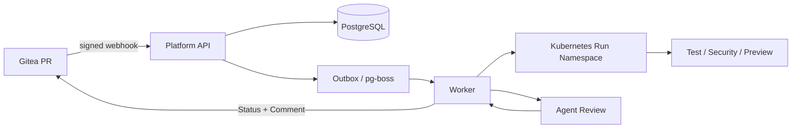

# CodeHost

AI 原生的 Pull Request 质量与 Kubernetes 临时预览平台。

CodeHost 以 Gitea 作为代码托管和协作入口，以 Kubernetes 运行受控的测试与预览任务，再由 Agent 根据代码变更、测试结果、安全扫描和运行日志生成结构化审查报告。它面向课程演示和受邀团队，不是 GitHub 的替代品，也不是生产级不可信代码沙箱。

## 核心闭环

```text
创建或更新 PR
    -> Gitea Pull Request Webhook
    -> API 校验签名并创建 Run
    -> detect -> fetch -> analyze -> test
    -> build -> preview -> health
    -> assemble-review-input -> agent-review -> report
    -> 回写 Commit Status 和 PR Comment
    -> 人工 Review 后合并
    -> 清理临时 Namespace、Job 和 PVC
```

平台审查发生在合并之前。Agent 只生成审查建议，最终合并由 Gitea 分支保护和人工 Reviewer 共同决定。

## 当前版本

课程版 P0 支持：

- Node.js `node-http` 和 Python `python-http` 两种固定 Profile。
- 单容器、单 HTTP 端口、平台生成的受控 Dockerfile。
- 固定测试、Gitleaks 安全扫描、Kubernetes 临时 Preview 和健康检查。
- 结构化 Agent Review、Finding、PR 评论和 Commit Status 回写。
- 每个 Run 独立 Namespace、ResourceQuota、LimitRange、临时 PVC 和自动清理。
- 本地 Docker Compose + k3d，以及单节点 k3s 服务器部署。

默认 Agent Provider 为 `mock`，适合无 GPU 的课程演示。使用 Mock Agent 证明的是完整审查工作流，不代表已经调用外部大模型服务。

课程版不包含公网任意仓库、多租户生产隔离、容器逃逸对抗、Agent 自动修改代码、自动合并、多节点高可用、GPU 推理和计费系统。

## Demo 快速开始

### 前置条件

- Gitea 中已有一个受邀仓库和 `main` 分支。
- 仓库配置了有效的 Gitea Webhook、Webhook Secret 和 Pull Request 事件。
- 服务器模式下，Gitea、API、Worker、Agent Review、PostgreSQL、Registry 和 k3s 已运行。
- 本地需要 Git；不需要启动本机 Docker，服务器模式的任务运行在远程 k3s。

### Webhook 配置

在 Gitea 仓库进入 `Settings -> Webhooks -> Add Webhook -> Gitea`，配置：

```text
Target URL:      http://platform-api:3000/webhooks/gitea
Content Type:    application/json
Secret:          与平台的 GITEA_WEBHOOK_SECRET 完全一致
Events:          Pull Request、Pull Request Sync
Active:          enabled
```

这里的 URL 是 Gitea Pod 访问平台 API 的集群内地址，不能填写用户电脑上的 `localhost`。

Webhook 配置完成后，在 `Recent Deliveries` 中应看到 `HTTP 202 Accepted`。如果只勾选了 Push 事件，PR 不会触发平台审查。

### 创建一次成功 PR

示例仓库需要在根目录具有 `package.json` + `server.js`，或者 `requirements.txt` + `main.py`。平台只识别仓库根目录，不会自动识别嵌套子目录中的项目。

```bash
git clone http://<gitea-host>/<owner>/<repo>.git
cd <repo>
git switch -c demo/review-smoke

printf '\n<!-- review smoke test -->\n' >> README.md
npm test                         # Node 示例

git add README.md
git commit -m "test: verify automated PR review"
git push -u origin demo/review-smoke
```

然后在 Gitea 创建从 `demo/review-smoke` 到 `main` 的 Pull Request。平台会自动执行 Run，并在 PR 页面回写：

```text
platform/test
platform/build
platform/security
platform/preview
platform/quality-review
```

测试失败时，可以推送空提交重新触发已存在 PR 的 `synchronize` 事件：

```bash
git commit --allow-empty -m "chore: retrigger platform review"
git push
```

### 查看审查证据

在 PR 的对话页面查看质量审查评论；在最新提交详情查看五个 `platform/*` Commit Status。每个 Status 必须绑定当前 PR 的最新 head SHA。

完整运行记录还包括 Run ID、步骤时间线、报告摘要、Finding、Preview 引用和清理结果。服务器模式没有稳定域名时，可以使用 SSH 隧道访问 Gitea：

```text
本机 13082 -> 远程 Gitea NodePort 30082
本机 13080 -> 远程 API NodePort 30080
本机 13081 -> 远程 Web NodePort 30081
```

## 架构



### 主要组件

| 组件 | 责任 |
| --- | --- |
| Gitea | 仓库、分支、PR、权限、Review、分支保护 |
| API | Webhook 签名校验、Run 查询、OAuth 和管理操作 |
| PostgreSQL | Run、步骤、报告、审计和可靠队列数据 |
| Worker | 工作流编排、Kubernetes 资源生命周期和 Gitea 回写 |
| Kubernetes | 每个 Run 的 Job、Preview、Service、PVC 和隔离 Namespace |
| Agent Review | 接收脱敏证据，输出严格 Schema 的结构化报告 |
| Registry | 保存固定基础镜像和受控的临时镜像 |

## 本地开发

本地环境由 Docker Compose 承载 Gitea、PostgreSQL、Registry、API、Worker、Web 和 Agent Review，k3d 承载每个 Run 的 Kubernetes 资源。

```bash
corepack enable
pnpm install --frozen-lockfile

infra/k3d/bootstrap.sh
docker compose up -d postgres gitea registry
docker compose --profile migration run --rm migrate
docker compose up -d api worker web agent-review
```

验证代码和配置：

```bash
pnpm typecheck
pnpm test
docker compose config --quiet
```

## 服务器部署

服务器演示使用单节点 k3s。推荐 8 vCPU、16 GiB RAM、80-100 GiB SSD，并为 k3s 系统组件预留至少 20% CPU 和内存。

```bash
cp infra/k3s/.env.example /tmp/platform-k3s.env
# 编辑 Registry、域名、镜像 Digest 和敏感值
set -a
. /tmp/platform-k3s.env
set +a
infra/k3s/install.sh
```

安装脚本会先应用 RBAC 和基础 PVC，等待 PostgreSQL 迁移 Job 完成，再滚动 API、Worker、Agent Review 和 Web。完整配置见 [infra/k3s/README.md](infra/k3s/README.md) 和 [docs/deployment.md](docs/deployment.md)。

常用检查命令：

```bash
kubectl get nodes
kubectl -n platform-system get pods,pvc
kubectl -n platform-system logs deploy/platform-worker --tail=200
kubectl get events -A --sort-by='.lastTimestamp'
```

如果 k3s 运行在 Docker 容器内，则使用：

```bash
docker exec ai-platform-k3s-rootful kubectl get nodes
docker exec ai-platform-k3s-rootful kubectl -n platform-system get pods
```

基础服务的 Gitea、PostgreSQL、Registry 和平台日志使用保留型 PVC；每个 Run 的 workspace PVC 随 Namespace 清理。清理或升级前应先备份平台 PVC。

## 验收口径

一次成功验收至少应证明：

1. Node 或 Python PR 能被 Webhook 接收并创建 Run。
2. `detect`、`fetch`、`analyze`、`test`、`build`、`preview`、`health` 和 Agent Review 能形成可追踪结果。
3. Gitea 收到五个当前 head SHA 对应的成功 Status 和质量评论。
4. PR 在人工批准前不能合并，批准后才能合并。
5. Run Namespace、Job、Preview 和 workspace PVC 能自动清理。
6. 测试失败时能阻断合并，同时保留失败原因和清理结果。

固定 Fixture 构建模式必须标注 `BUILD_MODE=FIXTURE`，不能将其描述为已经完成任意代码的动态安全构建。

## 故障排查

| 现象 | 优先检查 |
| --- | --- |
| PR 没有任何 Status | Webhook 是否启用 Pull Request 和 Pull Request Sync，Recent Deliveries 是否为 202 |
| Webhook 返回 401 | Secret 是否与平台 `GITEA_WEBHOOK_SECRET` 完全一致 |
| Webhook 返回连接错误 | URL 是否使用 `http://platform-api:3000/webhooks/gitea`，平台 API 是否 Running |
| Run 为 `UNSUPPORTED_PROFILE` | 根目录是否包含受支持的入口文件，不能只在子目录中放项目 |
| Run 卡在测试或 Preview | 查看 Worker 日志、Run Namespace、Job、Pod 事件和 Registry 拉取结果 |
| PR 页面访问不了 | 检查 SSH 隧道和对应 NodePort；本机 Docker 是否关闭不影响远程服务器 |
| 旧成功状态没有更新 | 确认状态绑定的是最新 head SHA，并向 PR 分支推送新提交触发 synchronize |

## 项目文档

- [开发指南](DEVELOPMENT.md)
- [贡献指南](CONTRIBUTING.md)
- [安全策略](SECURITY.md)
- [系统架构](docs/architecture.md)
- [威胁模型](docs/threat-model.md)
- [课程 Demo 脚本](docs/demo.md)
- [部署说明](docs/deployment.md)
- [验证记录](docs/verification.md)

## 许可证

本项目采用 [Apache-2.0](LICENSE) 许可证。
