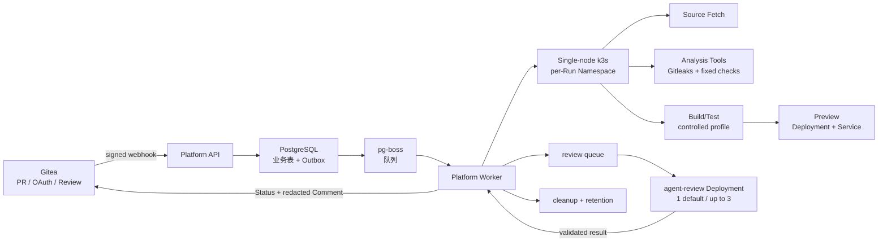

# Architecture

## 目标与边界

课程版平台围绕一条可重复的 PR 质量闭环构建：Gitea 接收代码协作，平台执行固定测试与安全检查，Kubernetes 提供临时 Preview，Agent 把证据整理成结构化报告，人工 Reviewer 决定是否合并。

平台不是完整 GitHub 替代品，不提供公网任意仓库、生产级多租户隔离、恶意代码沙箱、HA 或自动扩缩容。输入仅限受邀仓库和非敏感课程代码。

## 逻辑拓扑



## 核心流程

Webhook 接收器基于原始请求字节校验 `X-Gitea-Signature`，检查仓库允许列表、事件类型和事件时间，并用 delivery ID、payload hash、仓库、PR 编号和 head SHA 记录重放审计。事件、PR 当前状态、Run 和 `workflow_outbox` 在一个事务中写入，HTTP 请求立即返回 `202`。

Worker 从 Outbox 投递 pg-boss 并驱动以下步骤：

```text
detect -> fetch -> analyze -> test -> build -> preview -> health
       -> assemble-review-input -> agent-review -> report -> cleanup
```

每个 Run 的 `repository_id + pull_request_id + head_sha` 唯一。完整执行同时最多一个，最多三个 Run 排队；容量不足的事件仍记录为 `REJECTED_BY_CAPACITY`。应用失败仍收集可用证据并生成 Agent 报告；基础设施、模型或证据失败进入 `INCOMPLETE`，不能静默通过。

## Kubernetes 运行边界

每个 Run 创建唯一 `pr-run-<run-short-id>` Namespace，并在任务启动前配置 ResourceQuota、LimitRange 和 Restricted Pod Security。Run 资源包括 workspace PVC、Source Fetch Job、Analysis Tools Job、Build/Test Job、Preview Deployment、Service 和必要的 Ingress 配置。任务容器固定非 root、禁止权限提升、只读根文件系统、删除全部 capabilities、使用 RuntimeDefault seccomp，并关闭 ServiceAccount Token 自动挂载。

Build/Test 只能运行平台识别出的 Node/Python 固定 Profile 和平台生成的受控 Dockerfile。rootless BuildKit 是 P0 闸门；其 POC 未验证时，动态构建降为 P1，验收改用固定 Fixture 镜像。Preview 使用不可变 Digest，不挂载源码 PVC。

Worker 使用最小 RBAC 管理 Run Namespace、Job、Pod 日志、Deployment、Service、Ingress、PVC、Quota 和 LimitRange；它不管理 Node、CRD 或 RBAC，也不允许任务容器访问 Kubernetes API。Source Fetch 的一次性 Gitea 凭据用后删除，Build/Test、Analysis、Preview 和 Agent 不获得该凭据。

## Agent 边界与多副本

Analysis Tools Job 在 Run Namespace 内执行 Gitleaks 和固定静态检查，不调用模型。Worker 收集测试、构建和健康检查摘要，脱敏、截断到最多 64 KiB 后投递 review 队列。`agent-review` Deployment 只接收这些输入和受控模型 API Key，输出经 Zod strict Schema、大小、路径、行号和内容清洗后由 Worker 持久化。

默认部署一个 Agent review Pod；推荐的 8 vCPU/16 GB 单节点服务器可以配置三个 Pod。三个 Pod 可以和 Gitea、PostgreSQL、Worker、Preview 等共享同一 Node，调度单位是 Pod。它们是无状态队列消费者，处理不同 Run，不代表同一 PR 的三份 Agent 意见，也不执行用户代码、不访问 Kubernetes API、不读取 Sandbox Secret。

## 部署模式

本地模式使用 Compose 承载平台依赖、k3d 承载 Run 资源，并使用受控 port-forward 访问 Preview。服务器模式使用一台单节点 k3s，配合 Traefik Ingress 和私有 Registry；有稳定域名时设置 `PREVIEW_BASE_URL`，无稳定域名时只支持 SSH 隧道。两种模式不共用 Registry 地址。

单节点没有高可用能力，节点宕机会同时影响控制面、持久化服务、Agent Pod 和运行中的 Preview。系统组件、CoreDNS、local-path-provisioner、Traefik 和 Registry 至少预留 20% CPU 与内存。Gitea、PostgreSQL、Registry 和平台日志使用独立持久化卷；Run workspace PVC 可随 Namespace 清理。

## 数据与回写

PostgreSQL 保存 repositories、pull_requests、webhook_events、runs、run_steps、reports、findings、Gitea 同步、Kubernetes 资源、sessions 和 audit events。pg-boss 独占队列 schema。报告、日志、Finding 和临时镜像默认保留 7 天，Preview 默认保留 30 分钟；Gitea Comment 只保留脱敏摘要作为 PR 历史证据。

`GET /api/runs/:runId/logs` 只返回当前 attempt 的未过期 `run_steps` 日志，
并在读取前将记录路径解析到平台日志根目录内；缺失文件显示为不可用证据，
不会把任意文件系统路径暴露给会话用户。

平台回写 `platform/build`、`platform/test`、`platform/security`、`platform/preview` 和 `platform/quality-review`，状态必须绑定当前 head SHA。构建、测试、安全、健康、有效报告和一名非作者人工 Reviewer 都满足后，Gitea 才允许合并。
